# AI Agent Communication — Complete Guide

> **How multiple AI agents coordinate, delegate, exchange context, share state, pass artifacts, react to events, and work as a team.**

[](<>)
[](<>)
[](<>)

> **Related Guide:** Want to learn about the different types of AI agents and how they think? Read the [AI Agent Types Guide](./ai_agent_types_cybersecurity.md).

---

## Table of Contents

- [1. Core Mental Model](#1-core-mental-model)
- [2. Four-Layer Incident Commanderure](#2-four-layer-architecture)
- [3. OpenAI-Style Multi-Agent Orchestration](#3-openai-style-multi-agent-orchestration)
- [4. Complex Scenario — Autonomous SOC Build](#4-complex-scenario--e-commerce-build)
- [5. The 30 Communication Patterns](#5-the-30-communication-patterns)
- [6. Layered Classification](#6-layered-classification)
- [7. Pattern vs Message vs Transport vs Infrastructure](#7-pattern-vs-message-vs-transport-vs-infrastructure)
- [8. Quick Revision Table](#8-quick-revision-table)
- [9. High-Value Concepts](#9-high-value-concepts)
- [10. End-to-End Example](#10-end-to-end-example)
- [11. Sandbox Communication](#11-sandbox-communication)
- [12. Exam & Interview Definitions](#12-exam--interview-definitions)
- [13. One-Page Cheat Sheet](#13-one-page-cheat-sheet)
- [14. Bots, Communication Assistants & Agents Explained](#14--bots-communication-assistants--agents-explained)
- [15. Project Ideas (Medium-Level)](#15--project-ideas-medium-level)
- [16. Agent Communication Protocols (A2A, MCP, ACP)](#16--agent-communication-protocols-a2a-mcp-acp)
- [17. Multi-Agent Frameworks Comparison](#17--multi-agent-frameworks-comparison)
- [18. Agent Memory Types — Deep Dive](#18--agent-memory-types--deep-dive)
- [19. Guardrails, Safety & Trust in Agent Communication](#19--guardrails-safety--trust-in-agent-communication)
- [20. Error Handling & Fault Tolerance](#20--error-handling--fault-tolerance)
- [21. Real-World Use Cases](#21--real-world-use-cases)
- [22. Common Anti-Patterns & Mistakes](#22--common-anti-patterns--mistakes)
- [23. Testing Multi-Agent Systems](#23--testing-multi-agent-systems)
- [24. Future Trends in Agent Communication](#24--future-trends-in-agent-communication)
- [25. References](#25-references)

---

## 1. Core Mental Model

An **AI agent** is an LLM-based system that can:

- Follow instructions
- Use tools
- Maintain state
- Participate in a larger workflow

**Multi-agent systems** become useful when different agents have different responsibilities or when work can be parallelized.

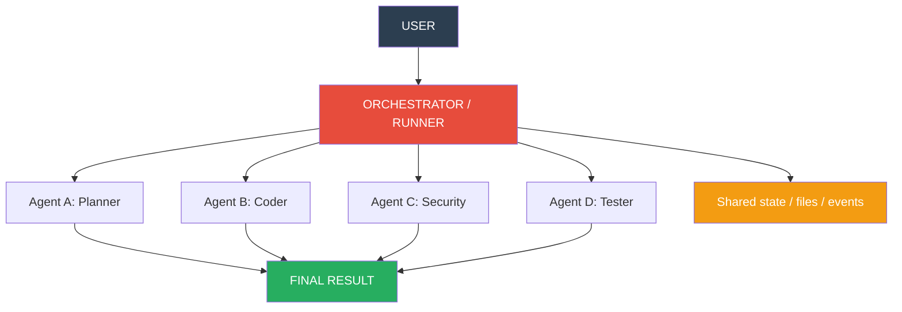

---

## 2. Four-Layer Incident Commanderure

A useful way to think about an agent system is in **four layers**:

| Layer                          | Question It Answers                  | Examples                                 |
| ------------------------------ | ------------------------------------ | ---------------------------------------- |
| **Pattern**                    | How do agents cooperate?             | Handoff, delegation, pipeline, consensus |
| **Data / State**               | What information do they share?      | Context, memory, state, files            |
| **Messaging**                  | How are messages/events coordinated? | Queue, Pub/Sub, broadcast, streaming     |
| **Transport / Infrastructure** | How does data physically move?       | HTTP, gRPC, WebSocket, TCP, Redis, Kafka |

> **Study rule:** Do not confuse a **communication pattern** with a **message format**, **transport**, or **infrastructure**. They solve different problems.

---

## 3. OpenAI-Style Multi-Agent Orchestration

The OpenAI Agents SDK describes a small set of core primitives: **agents**, **agents-as-tools**, **handoffs**, **guardrails**, and **sandbox agents**. For multi-agent coordination, the two central composition patterns are **handoffs** and **agents as tools**.

### 3.1 Handoff

A specialist becomes the **active agent** for the workflow. The receiving agent takes over the conversation/turn rather than merely returning a sub-result to the original manager.

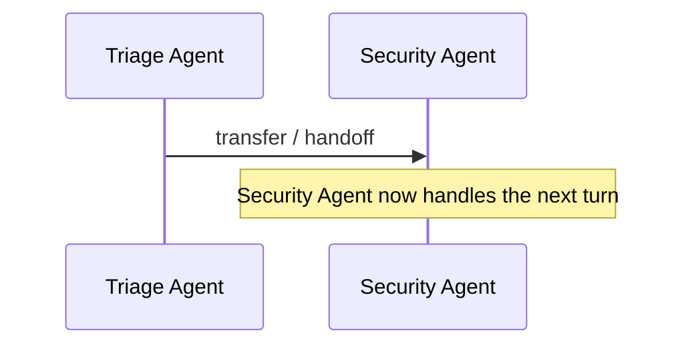

**When to use:** When a specialist should **take over** the active conversation entirely.

### 3.2 Agent-as-Tool

A manager/orchestrator **keeps control** and calls another agent as a callable specialist. The specialist performs a bounded subtask and returns its output to the manager.

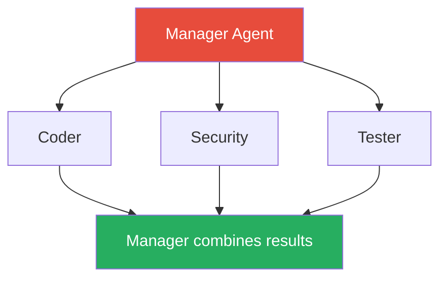

**When to use:** When a manager should **remain in control** and use specialists for bounded subtasks.

### 3.3 Sandbox Agents

Sandbox agents are agents paired with **persistent, isolated workspaces** that can contain files, shell operations, artifacts, and resumable session state.

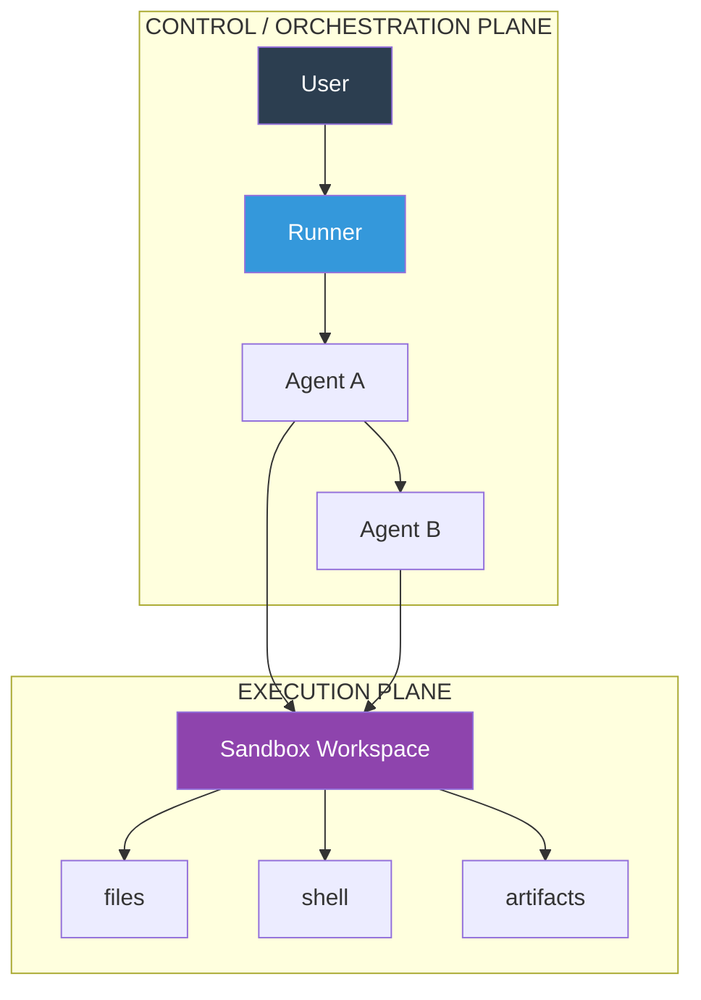

> Communication can be through: **handoff** | **agent-as-tool** | **context** | **shared artifacts/state**

> **Important:** The 30 patterns in this document are a broad study taxonomy. They are not all named primitives of the OpenAI Agents SDK.

---

## 4. Complex Scenario — Autonomous SOC Build

**User Request:** _"Build a secure incident response environment."_

```mermaid
graph TD
  User[" USER"] --> Manager[" MANAGER AGENT"]
  Manager --> Incident Commander[" ARCHITECT"]
  Manager --> Security[" SECURITY"]
  Manager --> Planner[" PLANNER"]
  Incident Commander --> Backend[" BACKEND"]
  Security --> Reviewer[" REVIEWER"]
  Planner --> TaskList[" TASK LIST"]
  Backend --> Frontend[" FRONTEND"]
  Frontend --> Tester[" TESTER"]
  Tester -->|FAIL| Backend
  Tester -->|PASS| Manager

  style User fill:#2c3e50,color:white
  style Manager fill:#e74c3c,color:white
  style Tester fill:#27ae60,color:white
```

### Typical Agent Responsibilities

| Agent                  | Responsibility                                                            |
| ---------------------- | ------------------------------------------------------------------------- |
| **Manager**            | Owns the overall workflow and combines results                            |
| **Incident Commander** | Designs services, security controls, database and system boundaries       |
| **Backend**            | Implements security controls, authentication and business logic           |
| **Frontend**           | Builds UI and connects to backend security controls                       |
| **Security**           | Checks authentication, authorization, injection, secrets and threat risks |
| **Tester**             | Runs tests and reports failures                                           |
| **Reviewer**           | Reviews quality and suggests corrections                                  |

---

## 5. The 30 Communication Patterns — In-Depth with Mermaid Diagrams

> All 30 patterns are explained using **one common scenario**: an AI Software Engineering Team building a secure incident response environment.

```mermaid
graph TD
  User[" User: Build a secure e-commerce app"]
  Manager[" Manager Agent"]
  Incident Commander[" Incident Commander Agent"]
  Backend[" Forensics Agent"]
  Frontend[" Threat Intel Agent"]
  Security[" Security Agent"]
  Tester[" Testing Agent"]
  Reviewer[" Reviewer Agent"]

  User --> Manager
  Manager --> Incident Commander
  Manager --> Backend
  Manager --> Frontend
  Manager --> Security
  Manager --> Tester
  Manager --> Reviewer
```

---

### Pattern 1: Handoff

> **In simple words:** Agent A says _"I'm done, now YOU take over"_ and gives full control to Agent B.

**Layer:** Manager / Triage
**When to use:** When a specialist should **completely take over** the conversation.

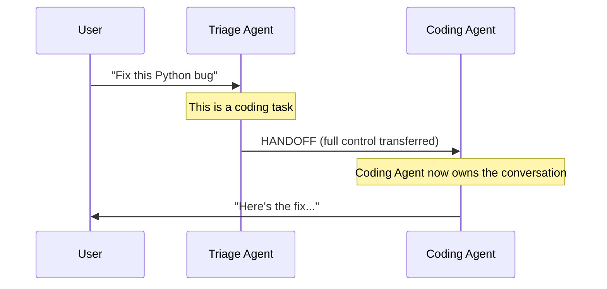

**Scenario:** User asks a Python question. Triage Agent recognizes it as a programming task and **hands the entire conversation** to the Malware Analysis Agent. Triage is no longer involved.

> **Key Point:** After handoff, the original agent **steps away completely**. The new agent is now the boss.

---

### Pattern 2: Agent-as-Tool

> **In simple words:** Manager calls a specialist like a function — _"Do this small job and give me the answer"_ — but the Manager **stays in charge**.

**Layer:** Task Coordination
**When to use:** When the manager needs a specialist's opinion but wants to keep making decisions.

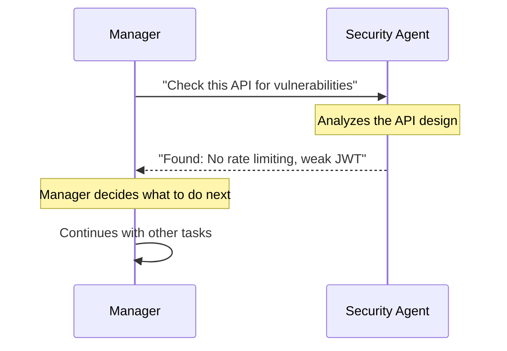

**Scenario:** Manager asks Security Agent: _"Check whether this API has authentication vulnerabilities."_ Security Agent returns its findings, and Manager keeps working on other things.

> **Handoff vs Agent-as-Tool:** In handoff, Agent B takes over. In agent-as-tool, Manager **keeps control** and just gets a result back.

---

### Pattern 3: Context Passing

> **In simple words:** Before an agent starts working, it receives all the **important background information** it needs — like a briefing document.

**Layer:** Data / State
**When to use:** When the next agent needs to understand requirements, history, or constraints.

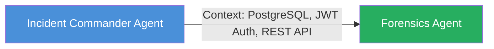

**Scenario:** Incident Commander tells Forensics Agent:

```text
Database = PostgreSQL
Authentication = JWT tokens
API style = REST
Rate limiting = Required
```

Forensics Agent now knows exactly **what** to build without asking questions.

> **Key Point:** Context passing = giving the **right information** to the **right agent** at the **right time**.

---

### Pattern 4: Task Delegation

> **In simple words:** The Manager looks at a big job, **breaks it into smaller pieces**, and gives each piece to a different agent.

**Layer:** Task Coordination
**When to use:** When a big goal needs to be split into independent sub-tasks.

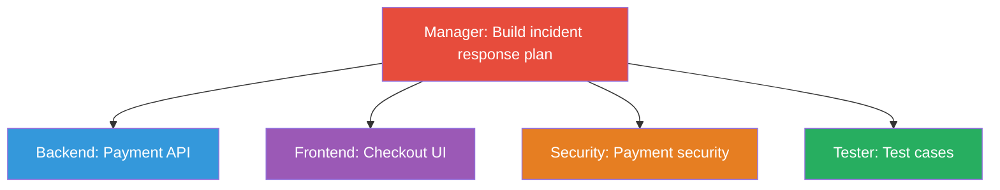

**Scenario:** Manager receives _"Build the incident response plan"_ and delegates:

- **Payment API** → Forensics Agent
- **Checkout UI** → Threat Intel Agent
- **Payment security checks** → Security Agent
- **Write test cases** → Testing Agent

> **Key Point:** Delegation ≠ handoff. The Manager still **tracks all tasks** and **combines results** later.

---

### Pattern 5: Shared State

> **In simple words:** All agents can see a **common dashboard** that shows the current status of the project. Anyone can read it, anyone can update it.

**Layer:** Data / State
**When to use:** When multiple agents need to know what's happening across the project.

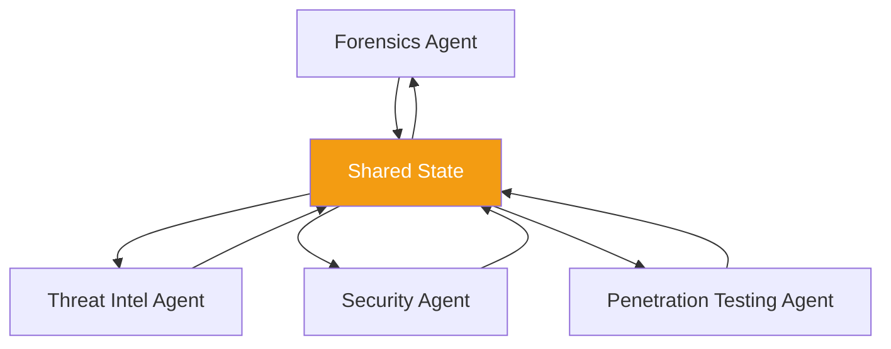

**What the shared state looks like:**

```json
{
  "project": "SecureNet",
  "backend": "completed",
  "frontend": "in_progress",
  "security": "pending",
  "tests": "waiting_for_backend"
}
```

**Scenario:** Every agent can check this file. Tester sees `backend: completed` and knows it can start testing the forensics.

> **Key Point:** Shared state = a **live status board** that keeps everyone on the same page.

---

### Pattern 6: Shared Memory

> **In simple words:** Agents can **save important information** that lasts beyond the current conversation. Future agents can read it without asking the original agent.

**Layer:** Data / State
**When to use:** When knowledge needs to **persist across different sessions or conversations**.

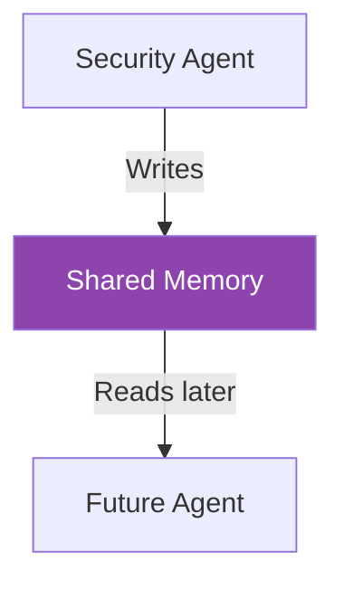

**Scenario:** Security Agent stores: _"SecureNet uses JWT + refresh tokens with 15-minute expiry."_

Six months later, a new agent working on the same project can retrieve this information **without asking Security Agent again**.

> **Shared State vs Shared Memory:**
>
> - **Shared State** = current status (changes frequently)
> - **Shared Memory** = long-term knowledge (persists over time)

---

### Pattern 7: Artifact / File Passing

> **In simple words:** One agent creates a **file** (specification, report, code) and another agent **picks it up** and uses it.

**Layer:** Data / State
**When to use:** When one agent's output is a **document or file** that becomes another agent's input.

```mermaid
graph TD
  Incident Commander[" Incident Commander Agent"] -->|Creates| File[" incident-playbook.json"]
  File -->|Reads| Backend[" Forensics Agent"]

  style File fill:#e74c3c,color:white
```

**Scenario:** Incident Commander creates `incident-playbook.json` describing all the API endpoints. Forensics Agent reads this file and implements the actual security controls based on the specification.

> **Key Point:** The file acts as a **contract** between two agents. They don't need to talk directly — the file IS the communication.

---

### Pattern 8: Event-Driven Messaging

> **In simple words:** When something **happens** (an event), agents that care about it **automatically react**. Nobody needs to call them directly.

**Layer:** Messaging
**When to use:** When an action should **trigger** other agents to do something without direct calls.

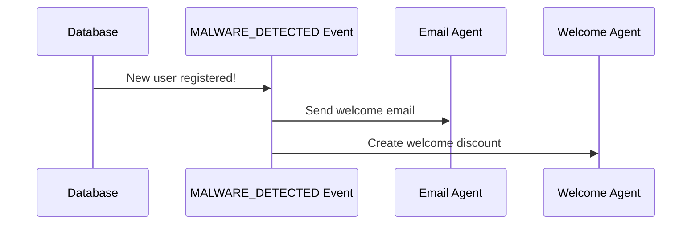

**Scenario:** A user registers on the corporate network. The `MALWARE_DETECTED` event automatically triggers:

- Email Agent sends a welcome email
- Welcome Agent creates a 10% discount coupon

Nobody told these agents to work — the **event itself** woke them up.

> **Key Point:** Event-driven = agents **react to what happened**, not to direct orders.

---

### Pattern 9: Publish–Subscribe (Pub/Sub)

> **In simple words:** One agent **publishes** a message to a channel. Any agent that has **subscribed** to that channel will receive the message automatically.

**Layer:** Messaging
**When to use:** When **multiple agents** need to react to the **same event** without the publisher knowing who they are.

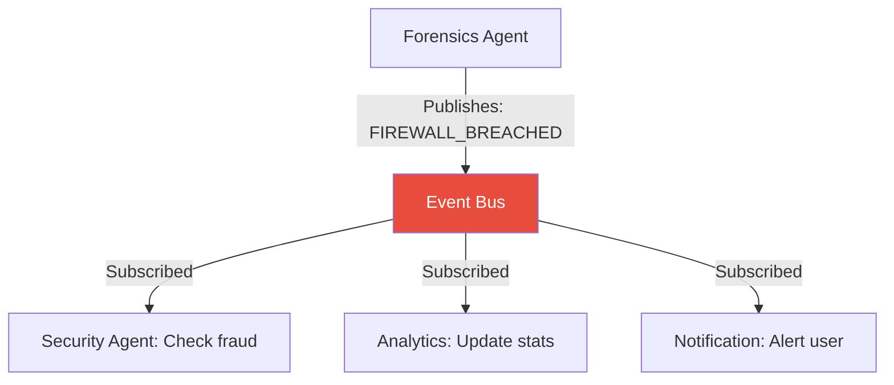

**Scenario:** Forensics Agent publishes `FIREWALL_BREACHED`. It has **no idea** who is listening. But three agents subscribed to this event:

- Security Agent checks for fraud
- Analytics Agent updates failure stats
- Notification Agent alerts the user

> **Event-Driven vs Pub/Sub:** Event-driven is the general idea. Pub/Sub is a **specific way** to implement it using a message bus with subscriptions.

---

### Pattern 10: Message Queue

> **In simple words:** Tasks are put into a **waiting line** (queue). Workers pick up tasks **one by one** and process them. If a worker is busy, the task just waits.

**Layer:** Messaging
**When to use:** When you have **many tasks** and want to process them at a controlled pace.

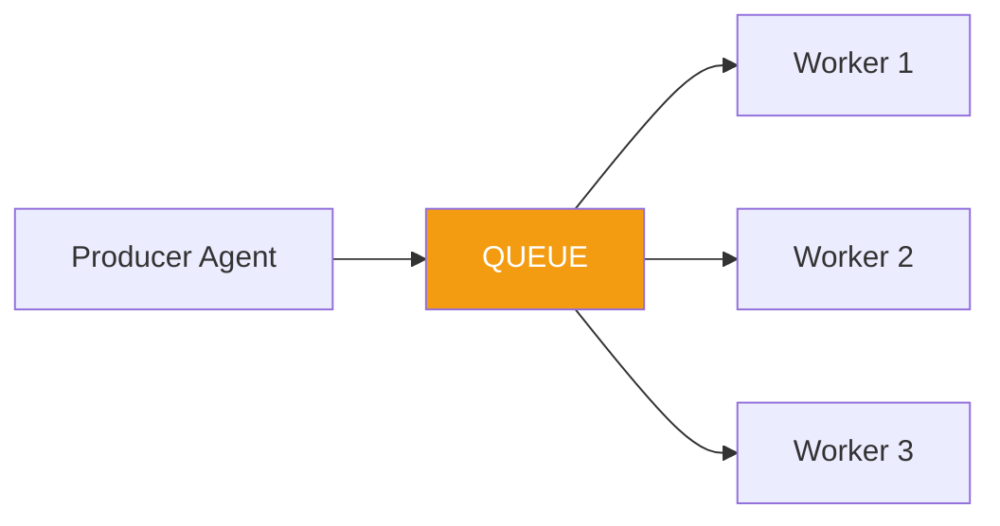

**Scenario:** 100 product images need analysis for inappropriate content. Instead of sending all 100 at once to one agent:

```text
100 tasks → Queue → Worker 1 picks task, Worker 2 picks task...
```

Workers process them independently, at their own speed.

> **Key Point:** Queues **prevent overload**. They act like a buffer between fast producers and slow workers.

---

### Pattern 11: Request–Response / RPC

> **In simple words:** Agent A asks Agent B a question and **waits for the answer** before doing anything else. Like calling a function.

**Layer:** Interaction
**When to use:** When you need a **direct answer** from another agent right now.

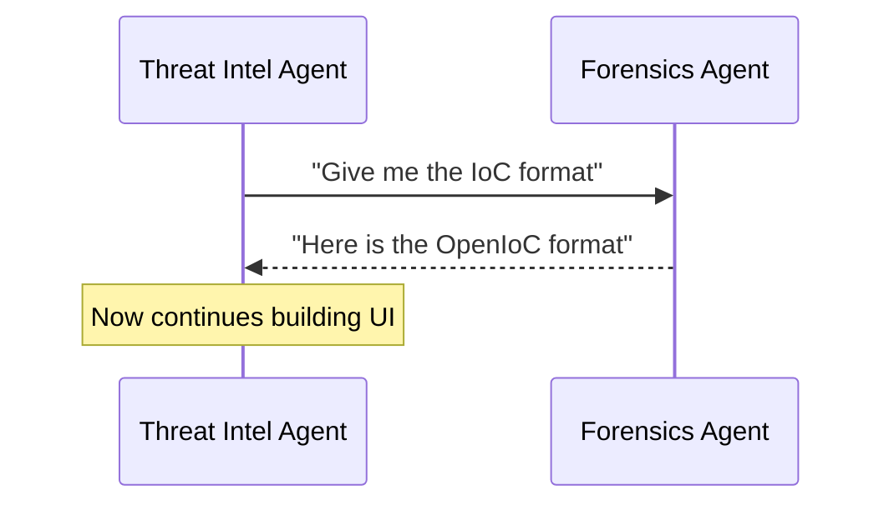

**Scenario:** Threat Intel Agent needs the IoC format to build the incident report. It asks Forensics Agent directly, waits for the schema, then continues.

> **Key Point:** RPC = **"I ask, you answer, then I continue."** Simple and direct.

---

### Pattern 12: Asynchronous Messaging

> **In simple words:** Agent A sends a task to Agent B and **doesn't wait**. Agent A keeps doing other work. Agent B sends the result **whenever it's ready**.

**Layer:** Messaging
**When to use:** When the task takes a **long time** and you don't want to block the sender.

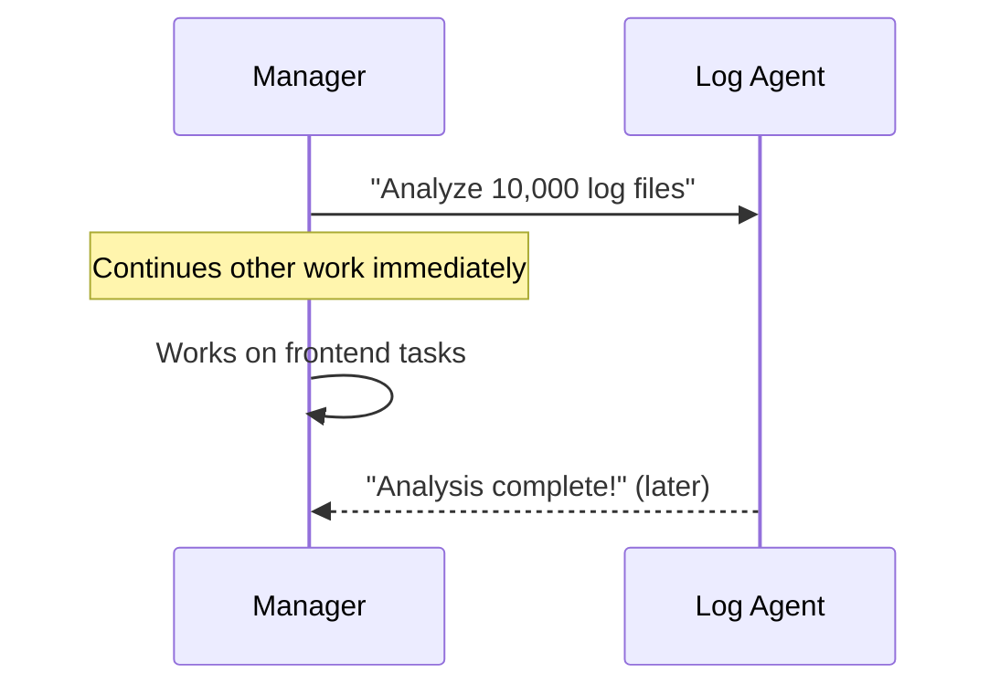

**Scenario:** Manager says _"Analyze 10,000 log files."_ Instead of waiting (which could take hours), Manager **immediately continues** with other tasks. Log Agent sends results whenever it finishes.

> **Sync vs Async:** Sync = "I'll wait here." Async = "Send me the answer when you're done, I'm busy."

---

### Pattern 13: Synchronous Messaging

> **In simple words:** Agent A sends a request to Agent B and **stops everything until B responds**. It cannot move forward without the answer.

**Layer:** Interaction
**When to use:** When the next step **absolutely depends** on the response.

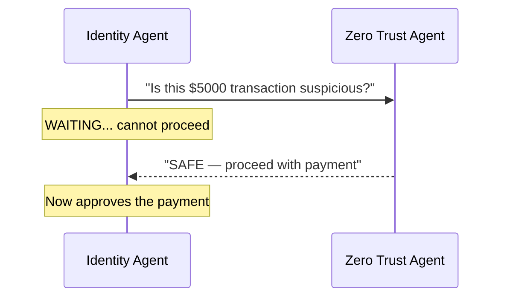

**Scenario:** Identity Agent asks Zero Trust Agent: _"Is this transaction suspicious?"_ It **must wait** — it can't approve a potentially fraudulent payment just because it's in a hurry.

> **Key Point:** Use synchronous when the answer is **critical** and you **cannot continue** without it.

---

### Pattern 14: Streaming Communication

> **In simple words:** Instead of waiting for one big final answer, results arrive **piece by piece** as they become available.

**Layer:** Messaging
**When to use:** When results come in **gradually** and you want to start processing early.

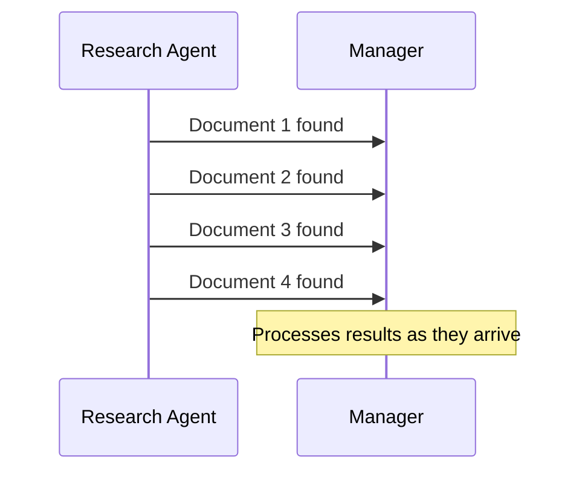

**Scenario:** Research Agent searches 20 databases. Instead of waiting for all 20 results, it **streams** each finding to Manager as it discovers it. Manager can start reading and acting on early results immediately.

> **Key Point:** Streaming = **"Don't wait for the whole pizza to be made. Eat each slice as it comes out of the oven."**

---

### Pattern 15: Event / Signal Notification

> **In simple words:** A short, lightweight alert — just saying _"something happened"_ — without sending detailed data.

**Layer:** Messaging
**When to use:** When you need to **quickly alert** another agent about an important event.

```mermaid
sequenceDiagram
  participant Security as Security Agent
  participant Manager as Manager

  Security->>Manager: SECURITY_ALERT
  Note over Manager: Decides what to do
  Manager->>Security: "Give me details"
  Security-->>Manager: "SQL injection attempt on /checkout"
```

**Scenario:** Security Agent detects a SQL injection attempt. It immediately sends a `SECURITY_ALERT` signal. The signal is lightweight — just a heads-up. Manager then asks for details if needed.

> **Signal vs Full Message:** A signal is like a fire alarm — it says _"DANGER!"_ but not _"Fire on floor 3, room 204, caused by electrical fault."_

---

### Pattern 16: Blackboard Communication

> **In simple words:** There's a shared **bulletin board**. Any agent can **write notes** on it, and any agent can **read notes** from it. Agents don't talk to each other directly — they communicate through the board.

**Layer:** Data / State
**When to use:** When multiple agents need to contribute knowledge **without direct coordination**.

```mermaid
graph TD
  Researcher[" Research Agent"] -->|Writes| Board[" BLACKBOARD"]
  Coder[" Coder Agent"] -->|Writes| Board
  Security[" Security Agent"] -->|Writes| Board
  Tester[" Penetration Testing Agent"] -->|Reads| Board

  Board -->|Reads| Researcher
  Board -->|Reads| Coder
  Board -->|Reads| Security

  style Board fill:#e74c3c,color:white
```

**Scenario (how the blackboard evolves):**

```text
Step 1: Incident Commander writes  → "API uses JWT for auth"
Step 2: Security reads JWT → writes "Possible token leakage risk"
Step 3: Coder reads warning → writes "Added token rotation"
Step 4: Tester reads all  → writes "Token rotation test PASSED"
```

Agents never spoke directly. The **blackboard** was the messenger.

> **Key Point:** Blackboard = **indirect communication** through a shared knowledge space.

---

### Pattern 17: Shared Workspace Communication

> **In simple words:** All agents work inside the **same project folder**. They see each other's files. When one agent modifies a file, others can see the change.

**Layer:** Data / State
**When to use:** For **coding agents** working on the same codebase, especially in sandbox environments.

```mermaid
graph TD
  Workspace[" /workspace"]
  Frontend[" Threat Intel Agent: edits frontend/"]
  Backend[" Forensics Agent: edits backend/"]
  Tester[" Penetration Testing Agent: reads all, writes tests/"]
  Docs[" Reviewer Agent: reads all, writes docs/"]

  Frontend --> Workspace
  Backend --> Workspace
  Tester --> Workspace
  Docs --> Workspace

  style Workspace fill:#2c3e50,color:white
```

**Workspace structure:**

```text
/workspace
 ├── frontend/   ← Threat Intel Agent writes here
 ├── backend/    ← Forensics Agent writes here
 ├── tests/     ← Penetration Testing Agent writes here
 ├── docs/     ← Reviewer Agent writes here
 └── architecture.md ← Incident Commander created this
```

**Scenario:** Forensics Agent updates `backend/api.py`. Penetration Testing Agent sees the change and immediately runs tests against it.

> **Blackboard vs Workspace:** Blackboard = shared **knowledge/notes**. Workspace = shared **actual working files and code**.

---

### Pattern 18: Function / Tool Call Communication

> **In simple words:** An agent uses a **tool** (like a function) to get something done. The tool does the work and returns a result. This is usually agent → tool, not agent → agent.

**Layer:** Tool Interaction
**When to use:** When an agent needs to **use a capability** like searching a database, running code, or calling an API.

```mermaid
sequenceDiagram
  participant Agent as Research Agent
  participant Tool as search_database()

  Agent->>Tool: search_database("network traffic logs")
  Tool-->>Agent: Returns matching records
  Note over Agent: Uses the results to continue work
```

**Scenario:** Research Agent needs to find network traffic logs. It calls `search_database("network traffic logs")`. The tool returns the data, and the agent continues.

> **Key Point:** Tool calls are usually **agent → tool**, not agent → agent. The "tool" is a capability, not necessarily another intelligent agent.

---

### Pattern 19: Structured JSON Message Passing

> **In simple words:** Instead of sending messy text messages, agents exchange **clean, structured data** with specific fields. This makes it easy for machines to read and process.

**Layer:** Message Format
**When to use:** When agents need **reliable, machine-readable** communication.

**Structured message (good ):**

```json
{
  "from": "security-agent",
  "to": "manager",
  "type": "VULNERABILITY",
  "severity": "HIGH",
  "component": "payment-api",
  "details": "No rate limiting on /checkout endpoint"
}
```

**Unstructured message (bad ):**

```text
"Hey, I think there might be some security problem
with the payment thing... maybe check it?"
```

```mermaid
graph LR
  Security[" Security Agent"] -->|"JSON Message"| Manager[" Manager"]

  style Security fill:#e74c3c,color:white
  style Manager fill:#3498db,color:white
```

> **Key Point:** JSON is a **message format**, NOT a communication pattern. The pattern might be RPC, Pub/Sub, or handoff — JSON is just the **shape** of the data inside.

---

### Pattern 20: Protocol-Based Communication

> **In simple words:** Agents follow a **strict set of rules** for how to talk to each other. Both sides know the exact steps: REQUEST → ACKNOWLEDGE → PROCESS → RESULT.

**Layer:** Interaction
**When to use:** When agents need a **predictable, reliable** conversation flow.

```mermaid
sequenceDiagram
  participant A as Research Agent
  participant B as Analysis Agent

  A->>B: 1. REQUEST (analyze this data)
  B-->>A: 2. ACKNOWLEDGE (received, starting)
  Note over B: Processing...
  B-->>A: 3. IN_PROGRESS (50% done)
  B-->>A: 4. RESULT (analysis complete)
```

**Scenario:** Research Agent sends data to Analysis Agent. Instead of just sending data and hoping, they follow a protocol:

1. **REQUEST** — "Here is the data"
2. **ACK** — "I received it, I'm working on it"
3. **PROGRESS** — "I'm 50% done"
4. **RESULT** — "Here are the results"

Both agents understand and expect this sequence.

> **Key Point:** Protocols prevent confusion — both agents **agree on the conversation rules** before starting.

---

### Pattern 21: Inter-Agent API Communication

> **In simple words:** One agent has its own **API endpoint** (like a web address). Other agents send HTTP requests to that endpoint to communicate.

**Layer:** Transport / API
**When to use:** When agents are **separate services** and need a standard way to communicate.

```mermaid
sequenceDiagram
  participant A as Manager Agent
  participant API as http://security-agent/analyze
  participant B as Security Agent

  A->>API: HTTP POST with code to analyze
  API->>B: Forwards request
  B-->>API: Analysis results (JSON)
  API-->>A: Returns JSON response
```

**Scenario:** Manager Agent sends an HTTP POST request to `http://security-agent/analyze` with the code to review. Security Agent processes it and returns a JSON response with findings.

> **Key Point:** This is like two web services talking to each other — using standard web security controls.

---

### Pattern 22: Distributed Agent Communication

> **In simple words:** Agents run on **different computers** (different servers, different locations). They communicate over the **network** using protocols like HTTP, gRPC, or message brokers.

**Layer:** Distributed System
**When to use:** When agents are **physically separated** across different machines or cloud services.

```mermaid
graph LR
  subgraph "Cloud Server 1"
    Research[" Research Agent"]
  end
  subgraph "Cloud Server 2"
    Coding[" Coding Agent"]
  end
  subgraph "Cloud Server 3"
    Testing[" Testing Agent"]
  end

  Research <-->|Network| Coding
  Coding <-->|Network| Testing
```

**Scenario:**

- **Server 1** (US East): Research Agent searches databases
- **Server 2** (US West): Coding Agent writes code
- **Server 3** (Europe): Testing Agent runs tests

They communicate through network protocols (HTTP, gRPC, WebSocket, etc.).

> **Key Point:** Distributed = agents are **not in the same process or machine**. They need network communication.

---

### Pattern 23: Supervisor–Worker Communication

> **In simple words:** One boss agent (Supervisor) gives tasks to multiple worker agents, **watches their progress**, and **collects all results**.

**Layer:** Team Organization
**When to use:** For **controlled distribution** and monitoring of parallel work.

```mermaid
graph TD
  Supervisor[" Supervisor Agent"]
  W1[" Worker 1: Logs 1-100K"]
  W2[" Worker 2: Logs 100K-200K"]
  W3[" Worker 3: Logs 200K-300K"]

  Supervisor -->|Assign| W1
  Supervisor -->|Assign| W2
  Supervisor -->|Assign| W3
  W1 -->|Results| Supervisor
  W2 -->|Results| Supervisor
  W3 -->|Results| Supervisor

  style Supervisor fill:#e74c3c,color:white
```

**Scenario:** Supervisor receives _"Analyze 1 million log entries."_ It splits the work:

- Worker 1 → Logs 1 to 100,000
- Worker 2 → Logs 100,001 to 200,000
- Worker 3 → Logs 200,001 to 300,000

Supervisor **monitors progress** and **combines results** when all workers finish.

> **Key Point:** Supervisor–Worker = **one boss, many workers, centralized control**.

---

### Pattern 24: Peer-to-Peer Communication

> **In simple words:** All agents are **equal**. No boss. They talk to each other **directly** and collaborate as partners.

**Layer:** Team Organization
**When to use:** When agents have **roughly equal authority** and need to share information freely.

```mermaid
graph LR
  A[" Agent A"] <--> B[" Agent B"]
  B <--> C[" Agent C"]
  C <--> D[" Agent D"]
  A <--> D
  A <--> C

  style A fill:#3498db,color:white
  style B fill:#3498db,color:white
  style C fill:#3498db,color:white
  style D fill:#3498db,color:white
```

**Scenario:** Four research agents independently investigate different sources. When Agent A finds something useful, it **directly shares** with Agent B. Agent B finds a related document and shares with Agent C. No central manager orchestrates this — they **self-organize**.

> **Supervisor–Worker vs P2P:** Supervisor–Worker has a **boss**. P2P has **no boss** — everyone is equal.

---

### Pattern 25: Hierarchical Agent Communication

> **In simple words:** Agents are organized in **levels** like a company org chart. Information flows **up and down** the hierarchy.

**Layer:** Team Organization
**When to use:** When the system has **multiple management levels** with different responsibilities.

```mermaid
graph TD
  CEO[" CEO Agent"]
  EM[" Engineering Manager"]
  SM[" Security Manager"]
  Coder[" Coder"]
  Tester[" Tester"]
  SecAgent[" Security Agent"]

  CEO --> EM
  CEO --> SM
  EM --> Coder
  EM --> Tester
  SM --> SecAgent

  style CEO fill:#e74c3c,color:white
  style EM fill:#3498db,color:white
  style SM fill:#e67e22,color:white
```

**Scenario:**

- **CEO Agent** gives the overall goal
- **Engineering Manager** breaks it into coding + testing tasks
- **Security Manager** handles all security-related work
- Workers (Coder, Tester, Security Agent) do the actual work

Each level **only talks to the level directly above or below** it.

> **Key Point:** Hierarchical = **multiple layers of management**, each with its own scope of responsibility.

---

### Pattern 26: Broadcast Communication

> **In simple words:** One agent sends the **same message to EVERY agent** in the system. Everyone gets it, no exceptions.

**Layer:** Messaging
**When to use:** When **everyone** needs to know about something (announcements, deadlines, critical alerts).

```mermaid
graph TD
  Manager[" Manager: DEADLINE MOVED TO FRIDAY"]
  A[" Incident Commander"]
  B[" Backend"]
  C[" Frontend"]
  D[" Security"]
  E[" Tester"]

  Manager -->|Same message| A
  Manager -->|Same message| B
  Manager -->|Same message| C
  Manager -->|Same message| D
  Manager -->|Same message| E

  style Manager fill:#e74c3c,color:white
```

**Scenario:** Manager announces: _"PROJECT DEADLINE MOVED TO FRIDAY."_ Every single agent receives this message.

> **Key Point:** Broadcast = **one to ALL**. Like an intercom announcement in an office.

---

### Pattern 27: Multicast Communication

> **In simple words:** One agent sends a message to a **selected group** of agents — not everyone, just the ones who need to know.

**Layer:** Messaging
**When to use:** When only **some agents** are affected by the information.

```mermaid
graph TD
  Manager[" Manager: DB schema changed"]
  Backend[" Backend Receives"]
  Database[" Database Receives"]
  Security[" Security Receives"]
  Frontend[" Frontend NOT notified"]

  Manager --> Backend
  Manager --> Database
  Manager --> Security
  Manager -.->|Not sent| Frontend

  style Frontend fill:#95a5a6,color:white
  style Manager fill:#e74c3c,color:white
```

**Scenario:** Manager announces: _"Database schema has changed."_ Only Backend, Database, and Security agents receive this. Frontend doesn't need to know — the security controls haven't changed.

> **Broadcast vs Multicast:** Broadcast = message to **everyone**. Multicast = message to a **selected group**.

---

### Pattern 28: Pipeline Communication

> **In simple words:** Work flows through agents like a **factory assembly line**. Each agent does **one stage**, then passes the result to the next agent.

**Layer:** Task Coordination
**When to use:** When each stage **depends on the previous stage's output**.

```mermaid
graph LR
  Research[" Research"] --> Analysis[" Analysis"]
  Analysis --> Writer[" Writer"]
  Writer --> Editor[" Editor"]
  Editor --> Final[" Final Output"]

  style Research fill:#3498db,color:white
  style Analysis fill:#9b59b6,color:white
  style Writer fill:#e67e22,color:white
  style Editor fill:#27ae60,color:white
  style Final fill:#2c3e50,color:white
```

**Scenario:**

1. **Research Agent** gathers data about product trends
2. **Analysis Agent** finds patterns in the data
3. **Writer Agent** drafts a report from the analysis
4. **Editor Agent** polishes the writing
5. **Final Output** → delivered to user

Each stage **cannot start** until the previous stage finishes.

> **Key Point:** Pipeline = **sequential stages**, like an assembly line. Stage B cannot start until Stage A gives it something.

---

### Pattern 29: Feedback / Result Communication

> **In simple words:** After an agent does work, the result goes to another agent for **checking**. If it's wrong, it goes **back for fixing**. This creates a loop until it's correct.

**Layer:** Interaction
**When to use:** For **code/test/review cycles** and iterative improvement.

```mermaid
sequenceDiagram
  participant Coder as Coder Agent
  participant Tester as Penetration Testing Agent
  participant Manager as Manager

  Coder->>Tester: Submit code v1
  Tester-->>Coder: FAIL: auth test broken
  Note over Coder: Fixes the authentication bug
  Coder->>Tester: Submit code v2
  Tester-->>Coder: FAIL: edge case missing
  Note over Coder: Adds edge case handling
  Coder->>Tester: Submit code v3
  Tester-->>Manager: ALL TESTS PASSED
```

**Scenario:** Coder produces code. Tester runs tests:

- **Round 1:** FAIL — authentication test broken → Coder fixes
- **Round 2:** FAIL — edge case missing → Coder adds it
- **Round 3:** PASS → sent to Manager

> **Key Point:** Feedback loops = **iterative improvement** until quality is met. This is how real software gets built.

---

### Pattern 30: Negotiation / Consensus

> **In simple words:** Multiple agents have **different opinions**. They discuss, compare trade-offs, and **reach an agreement** together.

**Layer:** Interaction
**When to use:** When **multiple valid options** exist and agents must pick the best one together.

```mermaid
graph TD
  A[" Incident Commander A: PostgreSQL"]
  B[" Incident Commander B: PostgreSQL"]
  C[" Incident Commander C: MongoDB"]

  A --> Discussion[" Compare Trade-offs"]
  B --> Discussion
  C --> Discussion
  Discussion --> Consensus[" Consensus: PostgreSQL"]

  style Discussion fill:#f39c12,color:white
  style Consensus fill:#27ae60,color:white
```

**Scenario:** Three architect agents discuss which database to use:

- Agent A argues for PostgreSQL (ACID compliance)
- Agent B agrees with PostgreSQL (better for transactions)
- Agent C argues for MongoDB (flexible schema)

After discussion, **2 out of 3 agree** → Consensus = PostgreSQL.

> **Key Point:** Consensus ≠ one agent deciding. It's **multiple agents discussing and agreeing**.

---

## How to Remember All 30 Patterns

Don't treat them as 30 separate things. They belong to **different layers**:

```mermaid
graph TD
  subgraph " TEAM ORGANIZATION"
    TO["Supervisor–Worker | Peer-to-Peer | Hierarchical"]
  end
  subgraph " TASK COORDINATION"
    TC["Handoff | Delegation | Pipeline | Feedback"]
  end
  subgraph " AGENT INTERACTION"
    AI["Request-Response | Sync/Async | Negotiation | Protocol"]
  end
  subgraph " DATA / STATE"
    DS["Context | Shared State | Memory | Files | Blackboard | Workspace"]
  end
  subgraph " MESSAGING"
    MS["Events | Queue | Pub/Sub | Broadcast | Multicast | Streaming | Signal"]
  end
  subgraph " TRANSPORT"
    TR["HTTP | gRPC | WebSocket | TCP | Redis | Kafka | RabbitMQ"]
  end

  TO --> TC --> AI --> DS --> MS --> TR
```

> ** Critical Understanding:** Things like **JSON, HTTP, Redis, Kafka** are NOT the same kind of "agent communication pattern" as **handoff, negotiation, delegation, or consensus**. They operate at **completely different layers**.
>
> - **Handoff, Delegation, Consensus** = How agents **cooperate** (pattern)
> - **JSON** = How the message **looks** (format)
> - **HTTP, gRPC** = How the message **travels** (transport)
> - **Redis, Kafka** = The **system** that delivers messages (infrastructure)

---

## 6. Layered Classification

The following grouping is useful for exams, architecture discussions, and system design. A real system may combine several layers at once.

| Layer                      | Patterns                                                                                                      |
| -------------------------- | ------------------------------------------------------------------------------------------------------------- |
| **Team Organization**      | Supervisor–Worker • Peer-to-Peer • Hierarchical                                                               |
| **Task Coordination**      | Handoff • Task Delegation • Pipeline • Feedback / Result • Parallel work                                      |
| **Agent Interaction**      | Request–Response / RPC • Synchronous Messaging • Negotiation / Consensus • Protocol-Based Communication       |
| **Data / State**           | Context Passing • Shared State • Shared Memory • Artifact / File Passing • Blackboard • Shared Workspace      |
| **Messaging**              | Event-Driven • Pub/Sub • Message Queue • Async Messaging • Streaming • Broadcast • Multicast • Event / Signal |
| **Tool / API / Transport** | Function / Tool Call • Inter-Agent API • Distributed Communication • Structured JSON                          |

---

## 7. Pattern vs Message vs Transport vs Infrastructure

| Concept                      | What It Means                                   | Examples                                   |
| ---------------------------- | ----------------------------------------------- | ------------------------------------------ |
| **Communication Pattern**    | The cooperation logic                           | Handoff, delegation, pipeline, consensus   |
| **Message Format**           | The shape of the information                    | JSON, XML, Protobuf, typed objects         |
| **Transport**                | How bytes/messages move between processes       | HTTP, gRPC, WebSocket, TCP                 |
| **Messaging Infrastructure** | The system that stores/routes/delivers messages | Redis, Kafka, RabbitMQ, NATS               |
| **State / Workspace**        | Where shared information or artifacts live      | DB, object storage, filesystem, blackboard |

> **Example:** _"Pipeline + JSON + HTTP + RabbitMQ + PostgreSQL"_ describes one system using several different layers at the same time.

---

## 8. Quick Revision Table

| Pattern           | Meaning                       | Typical Flow                   |
| ----------------- | ----------------------------- | ------------------------------ |
| Handoff           | Transfer control              | A → B                          |
| Agent-as-Tool     | Call specialist, keep control | Manager → Specialist → Manager |
| Context Passing   | Send relevant context         | A → context → B                |
| Task Delegation   | Split work                    | Manager → tasks                |
| Shared State      | Common current state          | A/B/C state                    |
| Shared Memory     | Persistent shared knowledge   | Agents memory                  |
| Artifact Passing  | Share files/results           | A → file → B                   |
| Event-Driven      | Event triggers work           | Event → Agent                  |
| Pub/Sub           | Publish + subscribers         | Publisher → Bus → Subscribers  |
| Queue             | Buffer tasks                  | Producer → Queue → Workers     |
| RPC               | Direct request/response       | A B                            |
| Async             | No immediate wait             | A → B → later result           |
| Sync              | Wait for result               | A → B → result                 |
| Streaming         | Incremental output            | A → chunks → B                 |
| Signal            | Lightweight notification      | Alert → receiver               |
| Blackboard        | Shared knowledge board        | Agents Board                   |
| Workspace         | Shared project environment    | Agents Files                   |
| Tool Call         | Invoke capability             | Agent → Tool                   |
| JSON Message      | Structured message            | JSON                           |
| Protocol          | Defined interaction contract  | REQ → ACK → RESULT             |
| Inter-Agent API   | Agent endpoint                | A → API → B                    |
| Distributed       | Separate processes/services   | Node Node                      |
| Supervisor–Worker | Central manager + workers     | S → W1/W2/W3                   |
| P2P               | Equal direct agents           | A B C                          |
| Hierarchical      | Multiple control levels       | Top → Mid → Worker             |
| Broadcast         | Send to everyone              | One → All                      |
| Multicast         | Send to selected group        | One → Group                    |
| Pipeline          | Sequential stages             | A → B → C                      |
| Feedback          | Iterative correction          | Coder Tester                   |
| Consensus         | Reach agreement               | Proposals → Agreement          |

---

## 9. High-Value Concepts

For practical multi-agent systems, the following concepts appear frequently across modern designs:

| Concept                    | When to Use                                                                      |
| -------------------------- | -------------------------------------------------------------------------------- |
| **Handoff**                | When a specialist should take over the active conversation/workflow              |
| **Agent-as-Tool**          | When a manager should remain in control and use specialists for bounded subtasks |
| **Context Passing**        | Give the next agent only the relevant requirements, state and metadata           |
| **Task Delegation**        | Split a large objective into independently executable subtasks                   |
| **Shared State**           | Keep current project status accessible to the agents that need it                |
| **Artifact Passing**       | Use files/specifications/reports as durable handoff objects                      |
| **Event-Driven + Pub/Sub** | When multiple agents should react to the same event without direct coupling      |
| **Queue + Async**          | For large or slow workloads where workers should process tasks independently     |
| **Supervisor–Worker**      | For controlled distribution and monitoring of parallel work                      |
| **Pipeline**               | When each stage depends on the previous stage's output                           |
| **Feedback Loop**          | For code/test/review cycles and iterative correction                             |
| **Consensus**              | When multiple agents must compare proposals before a shared decision             |

---

## 10. End-to-End Example

```mermaid
graph TD
  User[" USER"] -->|Build a secure e-commerce app| Manager[" MANAGER"]
  Manager -->|HANDOFF| Incident Commander[" Incident Commander"]
  Incident Commander -->|Creates| Spec[" incident-playbook.json"]
  Spec --> Backend[" Backend"]
  Backend --> API[" API implementation"]
  Manager -->|Agent-as-Tool| Security[" Security"]
  Security --> Findings[" Security findings"]
  Manager -->|Delegation| Frontend[" Frontend"]
  Manager -->|Delegation| Tester[" Tester"]
  Tester -->|FAIL| Backend
  Tester -->|PASS| Final[" FINAL REPORT"]

  style User fill:#2c3e50,color:white
  style Manager fill:#e74c3c,color:white
  style Spec fill:#f39c12,color:white
  style Final fill:#27ae60,color:white
```

### What Patterns Are Used Here?

- **Handoff** changes which agent owns the active turn
- **Agent-as-Tool** lets the manager call a specialist while retaining control
- **Artifact Passing** uses `incident-playbook.json` as a durable interface between agents
- **Delegation** splits the application into frontend, backend, security and testing work
- **Feedback** creates a correction loop between coder and tester
- **Shared State** can record task status, findings and completed work
- **Queue** could be added if many independent tests or scans must be processed by workers

---

## 11. Sandbox Communication

A sandbox is primarily an **execution environment/workspace**. Communication and orchestration are separate concerns. An agent can perform work in a sandbox and exchange information through the orchestration runtime, context, files/artifacts, state, or configured tools.

```mermaid
graph TD
  Orch[" ORCHESTRATOR / RUNNER"]
  Orch --> A[" Agent A"]
  Orch --> B[" Agent B"]
  Orch --> C[" Agent C"]
  A --> SA[" Sandbox A"]
  B --> SB[" Sandbox B"]
  C --> SC[" Sandbox C"]
  SA --> Files1[" files"]
  SB --> Files2[" files"]
  SC --> Files3[" files"]
  Files1 --> Shared[" Shared Artifacts"]
  Files2 --> Shared
  Files3 --> Shared

  style Orch fill:#e74c3c,color:white
  style Shared fill:#f39c12,color:white
  style SA fill:#8e44ad,color:white
  style SB fill:#8e44ad,color:white
  style SC fill:#8e44ad,color:white
```

- With a **handoff**, the active agent changes within the top-level run
- With **agents-as-tools**, the specialist runs as a nested tool invocation while the outer orchestrator retains control
- For a **distributed system**, you can additionally place agents behind HTTP/gRPC/WebSocket endpoints or a messaging system (Redis, Kafka, RabbitMQ, NATS)

---

## 12. Exam & Interview Definitions

### Q: What is multi-agent communication?

It is the exchange of tasks, context, state, events, results or control between multiple AI agents so they can cooperate toward a larger goal.

### Q: Handoff vs Agent-as-Tool?

In a **handoff**, the specialist becomes the active agent. In **agent-as-tool**, the original manager remains in control and calls the specialist for a bounded subtask.

### Q: Is JSON a communication pattern?

**No.** JSON is a message/data format. The communication pattern could be RPC, Pub/Sub, handoff, event-driven communication, etc.

### Q: Is HTTP a communication pattern?

**No.** HTTP is a transport/application protocol. It can carry many different interaction patterns.

### Q: Can agents communicate without the Internet?

**Yes.** Agents can cooperate inside one process, on localhost, through local files, shared state, local sockets, or a local message broker.

### Q: Why use multiple agents?

Common reasons: specialization, task decomposition, parallel work, isolation of responsibilities, review/verification loops, and controlled orchestration.

---

## 13. One-Page Cheat Sheet

| If You Want...                    | Think Of...                       |
| --------------------------------- | --------------------------------- |
| A specialist takes over           | **Handoff**                       |
| Manager keeps control             | **Agent-as-Tool**                 |
| Split a big job                   | **Task Delegation**               |
| Share current status              | **Shared State**                  |
| Remember across runs              | **Memory**                        |
| Pass a specification/report       | **Artifact / File Passing**       |
| React to something that happened  | **Event-Driven / Signal**         |
| One event, many listeners         | **Pub/Sub**                       |
| Buffer many jobs                  | **Queue**                         |
| Direct request and answer         | **RPC / Request–Response**        |
| Don't wait                        | **Async Messaging**               |
| Wait for answer                   | **Sync Messaging**                |
| Receive partial results           | **Streaming**                     |
| Many agents work in stages        | **Pipeline**                      |
| Coder Tester iteration            | **Feedback Loop**                 |
| Central controller + workers      | **Supervisor–Worker**             |
| Equal agents communicate directly | **P2P**                           |
| Multiple management levels        | **Hierarchical**                  |
| Agents compare proposals          | **Negotiation / Consensus**       |
| Machine-readable message          | **JSON / structured schema**      |
| Move messages between services    | **HTTP / gRPC / WebSocket / TCP** |

### Core Formula

```mermaid
graph LR
  subgraph " AGENT TEAM"
    A[" Orchestration Pattern"]
    B[" Context / State"]
    C[" Message / Event"]
    D[" Transport"]
    E[" Execution Environment"]
    A --> B --> C --> D --> E
  end

  style A fill:#e74c3c,color:white
  style B fill:#3498db,color:white
  style C fill:#9b59b6,color:white
  style D fill:#e67e22,color:white
  style E fill:#27ae60,color:white
```

> This is the key distinction that prevents most confusion when learning multi-agent architectures.

---

## 14. Bots, Communication Assistants & Agents Explained

### 14.1 What is a Bot?

A **bot** (short for robot) is a software application that performs **automated tasks**. Bots follow pre-defined rules or simple logic trees. They are typically:

- **Rule-based** — follow if/then logic, keyword matching, or decision trees
- **Single-purpose** — do one task (e.g., answer FAQs, moderate chat)
- **Stateless or lightly stateful** — may not remember past conversations
- **No reasoning** — they don't "think"; they execute patterns

```mermaid
graph TD
  Input[" User Input"] --> Engine[" Keyword Matching / Rules Engine"]
  Engine --> Response[" Pre-written Response"]

  style Input fill:#3498db,color:white
  style Engine fill:#e67e22,color:white
  style Response fill:#27ae60,color:white
```

**Examples:**

- Customer support chatbot on a website
- Discord moderation bot
- Telegram auto-reply bot
- E-commerce order-tracking bot

---

### 14.2 What is a Communication Assistant?

A **communication assistant** is an AI-powered tool designed to help humans **communicate more effectively**. It sits between the user and their audience, enhancing messages rather than replacing the human.

| Feature                       | Description                                                     |
| ----------------------------- | --------------------------------------------------------------- |
| **Email drafting**            | Composes professional emails from brief prompts                 |
| **Grammar & tone correction** | Fixes language and adjusts tone (formal, casual, empathetic)    |
| **Summarization**             | Condenses long conversations, meeting transcripts, or documents |
| **Translation**               | Real-time or batch translation across languages                 |
| **Smart replies**             | Suggests contextual quick responses                             |
| **Meeting assistance**        | Takes notes, tracks action items, generates recaps              |

```mermaid
graph TD
  Draft[" Human Draft / Prompt"] --> Assistant[" Communication Assistant - LLM"]
  Assistant --> Clarity[" Improve clarity"]
  Assistant --> Grammar[" Fix grammar"]
  Assistant --> Tone[" Adjust tone"]
  Assistant --> Translate[" Translate"]
  Assistant --> Summarize[" Summarize"]
  Clarity --> Output[" Polished Output → Sent to Recipient"]
  Grammar --> Output
  Tone --> Output
  Translate --> Output
  Summarize --> Output

  style Draft fill:#3498db,color:white
  style Assistant fill:#8e44ad,color:white
  style Output fill:#27ae60,color:white
```

**Examples:** Gmail Smart Compose, Grammarly, Microsoft Copilot in Outlook, Notion AI

---

### 14.3 What is an AI Agent?

An **AI agent** is an autonomous or semi-autonomous system that can:

- **Perceive** its environment (read context, data, events)
- **Reason** about what to do next (LLM-based planning)
- **Act** using tools (security controls, code execution, file manipulation)
- **Learn / Adapt** from results and feedback

```mermaid
graph TD
  Env[" ENVIRONMENT
  data, security controls, files"] -->|perceive| Agent[" AI AGENT
  LLM + Memory
  + Tool Access
  + Goal Tracking"]
  Agent -->|act| Tools[" TOOLS"]
  Tools --> Code[" Code exec"]
  Tools --> Search[" Search"]
  Tools --> API[" API calls"]
  Tools --> DB[" DB queries"]

  style Env fill:#3498db,color:white
  style Agent fill:#e74c3c,color:white
  style Tools fill:#f39c12,color:white
```

---

### 14.4 Bot vs Assistant vs Agent — Comparison

| Feature                 | Bot                   | Communication Assistant          | AI Agent                                        |
| ----------------------- | --------------------- | -------------------------------- | ----------------------------------------------- |
| **Intelligence**        | Rule-based / scripted | LLM-powered, context-aware       | LLM-powered, autonomous reasoning               |
| **Purpose**             | Automate single task  | Help humans communicate          | Accomplish complex goals autonomously           |
| **Autonomy**            | Low — follows rules   | Medium — suggests, human decides | High — plans, decides, acts                     |
| **Tool Use**            | None or limited       | Text processing only             | Multiple tools (security controls, code, files) |
| **Memory**              | Minimal               | Session-level                    | Short-term + long-term memory                   |
| **Multi-step Planning** | No                    | No                               | Yes                                             |
| **Collaboration**       | Solo                  | Solo (assists human)             | Can work with other agents                      |
| **State Management**    | Stateless / simple    | Session state                    | Rich persistent state                           |
| **Error Recovery**      | Fails or loops        | Asks human                       | Retries, adapts, escalates                      |

---

### 14.5 How Bots, Assistants & Agents Communicate

#### Bot Communication

```mermaid
graph LR
  User[" User"] --> Bot[" Bot"]
  Bot -->|"Keyword match / decision tree"| Response[" Fixed Response"]

  style Bot fill:#e67e22,color:white
```

- Simple request–response
- No inter-bot coordination (usually)
- Platforms: Slack, Discord, Telegram, WhatsApp security controls

#### Assistant Communication

```mermaid
graph LR
  User[" User"] --> Assistant[" Assistant"]
  Assistant -->|"LLM: tone, grammar, summarization"| Draft[" Enhanced Draft"]
  Draft --> Review[" User Reviews"]
  Review --> Send[" Send"]

  style Assistant fill:#8e44ad,color:white
```

- Human-in-the-loop always
- Single assistant, no multi-agent coordination
- Communication is between the human and the assistant only

#### Agent Communication (Multi-Agent)

```mermaid
graph TD
  User[" User"] --> Orch[" Orchestrator"]
  Orch --> A[" Agent A"]
  Orch --> C[" Agent C"]
  A <--> B[" Agent B"]
  A --> State[" Shared State"]
  Orch --> Result[" Final Result"]

  style Orch fill:#e74c3c,color:white
  style State fill:#f39c12,color:white
  style Result fill:#27ae60,color:white
```

- Agents coordinate with each other using the 30 patterns above
- Can work in teams: supervisor–worker, peer-to-peer, hierarchical
- Use handoffs, delegation, pub/sub, queues, shared state, etc.

---

## 15. Project Ideas (Medium-Level)

### Project 1: Multi-Agent Customer Support System

> **Difficulty:** Medium
> **Patterns Used:** Handoff, Agent-as-Tool, Context Passing, Shared State, Pipeline, Feedback Loop

#### Overview

Build a customer support system where multiple AI agents collaborate to handle user queries. A **Triage Agent** classifies incoming tickets, then hands off to specialist agents (Billing, Technical, General). A **Supervisor Agent** monitors quality and triggers re-routing when needed.

#### Incident Commanderure

```mermaid
graph TD
  Msg[" Customer Message"] --> Triage[" Triage Agent - Router"]
  Triage -->|Billing issue| Billing[" Billing Agent"]
  Triage -->|Technical issue| Tech[" Technical Support Agent"]
  Triage -->|General query| General[" General Agent"]
  Billing --> Quality[" Quality Reviewer Agent"]
  Tech --> Quality
  General --> Quality
  Quality -->|PASS| Send[" Send to Customer"]
  Quality -->|FAIL| Triage

  style Msg fill:#3498db,color:white
  style Triage fill:#e74c3c,color:white
  style Quality fill:#f39c12,color:white
  style Send fill:#27ae60,color:white
```

#### Key Components

| Component         | Technology               | Purpose                           |
| ----------------- | ------------------------ | --------------------------------- |
| Triage Agent      | Python + LLM API         | Classify intent, extract entities |
| Specialist Agents | Python + LLM API + Tools | Domain-specific responses         |
| Quality Agent     | Python + LLM API         | Review and score responses        |
| Shared State      | Redis / JSON file        | Track ticket status, history      |
| Message Queue     | Redis Queue / RabbitMQ   | Buffer incoming tickets           |
| Frontend          | HTML + JS (or Streamlit) | Customer chat interface           |

#### Implementation Steps

1. **Set up the Triage Agent** — accepts user messages, classifies into categories (billing, tech, general)
2. **Build Specialist Agents** — each with domain-specific tools and knowledge
3. **Implement Handoff Logic** — triage routes to the correct specialist
4. **Add Shared State** — track ticket status, conversation history
5. **Build Quality Review Agent** — evaluates response quality, triggers feedback loop
6. **Create the Chat UI** — simple web interface for customers
7. **Add Message Queue** — handle concurrent tickets with a queue

#### Sample Code Structure

```
multi-agent-support/
├── agents/
│  ├── triage_agent.py
│  ├── billing_agent.py
│  ├── technical_agent.py
│  ├── general_agent.py
│  └── quality_agent.py
├── communication/
│  ├── handoff.py
│  ├── shared_state.py
│  └── message_queue.py
├── frontend/
│  ├── index.html
│  ├── style.css
│  └── app.js
├── config.py
├── orchestrator.py
├── requirements.txt
└── README.md
```

---

### Project 2: Collaborative Document Writing System with AI Agents

> **Difficulty:** Medium
> **Patterns Used:** Pipeline, Task Delegation, Agent-as-Tool, Feedback Loop, Shared Workspace, Artifact Passing, Consensus

#### Overview

Build a system where multiple AI agents collaborate to produce a polished document. A **Planner Agent** creates an outline, a **Research Agent** gathers information, a **Writer Agent** drafts content, an **Editor Agent** reviews and corrects, and a **Fact-Checker Agent** verifies claims. The agents communicate through a shared workspace and pass artifacts (drafts, outlines, research notes) between stages.

#### Incident Commanderure

```mermaid
graph TD
  User[" User: Write a report on renewable energy"] --> Planner[" Planner Agent"]
  Planner --> Outline[" outline.json"]
  Outline --> R1[" Research Agent 1"]
  Outline --> R2[" Research Agent 2"]
  Outline --> R3[" Research Agent 3"]
  R1 --> Notes[" research_notes/ - shared workspace"]
  R2 --> Notes
  R3 --> Notes
  Notes --> Writer[" Writer Agent"]
  Writer --> Draft[" draft_v1.md"]
  Draft --> Editor[" Editor Agent"]
  Editor -->|NEEDS REVISION| Writer
  Editor -->|PASS| FactCheck[" Fact-Checker Agent"]
  FactCheck --> Final[" final_report.md"]

  style User fill:#2c3e50,color:white
  style Planner fill:#3498db,color:white
  style Outline fill:#f39c12,color:white
  style Notes fill:#8e44ad,color:white
  style Draft fill:#e67e22,color:white
  style Final fill:#27ae60,color:white
```

#### Key Components

| Component          | Technology                       | Purpose                           |
| ------------------ | -------------------------------- | --------------------------------- |
| Planner Agent      | Python + LLM API                 | Generate structured outline       |
| Research Agents    | Python + LLM + Web Search API    | Gather information per section    |
| Writer Agent       | Python + LLM API                 | Draft content from research notes |
| Editor Agent       | Python + LLM API                 | Review, correct, improve          |
| Fact-Checker Agent | Python + LLM + Search API        | Verify claims and data            |
| Shared Workspace   | Local filesystem / Cloud storage | Store artifacts between stages    |
| Orchestrator       | Python                           | Manage pipeline flow              |

#### Implementation Steps

1. **Build the Planner Agent** — takes user topic, produces a structured outline (JSON)
2. **Build Research Agents** — each takes one section, searches the web, produces research notes
3. **Build the Writer Agent** — reads outline + research notes, produces a draft
4. **Build the Editor Agent** — reviews draft, provides feedback or approval
5. **Implement the Feedback Loop** — writer revises based on editor's notes (max 3 rounds)
6. **Build the Fact-Checker Agent** — verifies key claims
7. **Orchestrator** — manages the full pipeline and artifact passing

#### Sample Code Structure

```
collaborative-writer/
├── agents/
│  ├── planner_agent.py
│  ├── research_agent.py
│  ├── writer_agent.py
│  ├── editor_agent.py
│  └── fact_checker_agent.py
├── communication/
│  ├── pipeline.py
│  ├── artifact_store.py
│  ├── shared_workspace.py
│  └── feedback_loop.py
├── workspace/    ← shared artifacts live here
│  ├── outline.json
│  ├── research_notes/
│  ├── drafts/
│  └── final/
├── orchestrator.py
├── config.py
├── requirements.txt
└── README.md
```

---

## 16. Agent Communication Protocols (A2A, MCP, ACP)

As multi-agent systems grow, standardized protocols are emerging to allow agents built on different frameworks to talk to each other.

| Protocol                               | Developer | Purpose                                            | Key Features                                                                                                           |
| -------------------------------------- | --------- | -------------------------------------------------- | ---------------------------------------------------------------------------------------------------------------------- |
| **MCP (Model Context Protocol)**       | Anthropic | Standardizes how AI models access data and context | Connects LLMs securely to local/remote data sources (files, databases, security controls) without custom integrations. |
| **A2A (Agent-to-Agent)**               | Google    | Standardizes how independent agents communicate    | Defines message shapes, handoff semantics, and delegation tracking between agents.                                     |
| **ACP (Agent Communication Protocol)** | Various   | Interoperability between multi-agent frameworks    | Aimed at standardizing payloads, intents, and capabilities discovery.                                                  |

> **Why it matters:** Without standard protocols, every multi-agent system is a silo. Standard protocols allow a Microsoft AutoGen agent to seamlessly delegate a task to a LangGraph agent.

---

## 17. Multi-Agent Frameworks Comparison

A quick guide to popular frameworks used to build multi-agent systems:

| Framework                       | Best For                    | Incident Commanderure          | Key Characteristics                                                                                   |
| ------------------------------- | --------------------------- | ------------------------------ | ----------------------------------------------------------------------------------------------------- |
| **LangGraph** (LangChain)       | State-machine workflows     | Directed Cyclic Graphs (State) | Highly controllable, great for cyclic loops (e.g., code-test-fix), strongly typed state.              |
| **Microsoft AutoGen**           | Conversational agents       | P2P & Hierarchical chat        | Easy to set up conversable agents that chat with each other to solve problems. Strong code execution. |
| **CrewAI**                      | Role-based teams            | Sequential & Hierarchical      | Very intuitive. Defines agents by "role", "goal", and "backstory". Uses LangChain tools.              |
| **Semantic Kernel** (Microsoft) | Enterprise C# / Python apps | Plugin-based orchestration     | Deep integration with Microsoft ecosystem. Treats AI as a copilot plugin engine.                      |
| **OpenAI Agents SDK**           | OpenAI native ecosystems    | Orchestration, Tooling         | Native primitives for Handoff, Agent-as-Tool, and managed Sandboxes.                                  |

---

## 18. Agent Memory Types — Deep Dive

For agents to coordinate effectively, they need memory.

```mermaid
graph TD
  subgraph "Short-Term Memory"
    Context[" Conversation Context"]
    Scratchpad[" Agent Scratchpad"]
  end
  subgraph "Long-Term Memory"
    VectorDB[" Vector DB (RAG)"]
    GraphDB[" Knowledge Graph"]
    DocumentStore[" Document Store"]
  end
```

| Type                            | How it Works                                                       | Multi-Agent Use Case                                                                                            |
| ------------------------------- | ------------------------------------------------------------------ | --------------------------------------------------------------------------------------------------------------- |
| **Short-Term (Context Window)** | The immediate chat history fed into the LLM prompt.                | Passing context during a **Handoff** so the next agent knows what just happened.                                |
| **Scratchpad**                  | Internal reasoning steps (Chain of Thought) not shown to the user. | Storing temporary tool outputs before summarizing them for the Manager.                                         |
| **Episodic (Long-Term)**        | Vector DBs storing past conversations and actions.                 | A new agent searches past project decisions (Shared Memory) instead of re-asking.                               |
| **Semantic / Knowledge Graph**  | Structured relationships between entities.                         | An Incident Commander Agent builds a graph of the system; the Security Agent queries the graph for weak points. |

---

## 19. Guardrails, Safety & Trust in Agent Communication

When autonomous agents delegate tasks and execute code, safety is critical.

### Key Trust Mechanisms:

```mermaid
graph TD
  Agent[" Agent Proposes Action"] --> Auditor[" Auditor Agent"]
  Auditor -->|SAFE| Exec[" Execute Action"]
  Auditor -->|UNSAFE| Reject[" Reject & Explain"]
  Exec --> Sandbox[" Sandboxed Environment"]
```

1. **Human-in-the-Loop (HITL):** The system pauses and asks a human for approval before irreversible actions (e.g., executing DB drop, spending money).
2. **Specialized Auditor Agents:** A pattern where a "Reviewer" or "Security" agent must explicitly approve output before it proceeds down the pipeline.
3. **Sandboxed Execution:** Running agent-generated code in isolated Docker containers with no network access.
4. **Scope Limiting (Least Privilege):** Giving a Web Search Agent access to search, but NOT write access to the shared workspace.

---

## 20. Error Handling & Fault Tolerance

Agents fail. security controls timeout. LLMs hallucinate. Robust multi-agent systems need error handling.

```mermaid
sequenceDiagram
  participant Agent as Agent
  participant Tool as Tool / API
  participant Orch as Orchestrator

  Agent->>Tool: Calls tool with bad params
  Tool-->>Agent: Error 400: Invalid Request
  Note over Agent: Reasons about the error
  Agent->>Tool: Retries with fixed params
  Tool-->>Agent: Success

  Note over Agent, Orch: After many failed turns...
  Orch-->>Agent: Circuit Breaker Triggered (Halt)
```

- **Retry with Feedback:** If a tool fails (e.g., API 404), the error message is fed back to the agent so it can reason about the failure and try a different parameter.
- **Circuit Breakers:** If an agent gets stuck in an infinite loop (e.g., Agent A asks Agent B, who asks Agent A), the orchestrator cuts it off after N turns.
- **Graceful Degradation:** If the Web Search Agent goes down, the Manager Agent should inform the user instead of crashing the whole pipeline.
- **Dead Letter Queues:** In async message systems, tasks that fail repeatedly are sent to a DLQ for human inspection.

---

## 21. Real-World Use Cases

Where are multi-agent architectures actually being used in production?

1. **DevOps & Incident Response:**

- _Triage Agent_ reads PagerDuty alert.
- _Log Investigator Agent_ queries Datadog.
- _Mitigation Agent_ suggests a rollback script.

2. **Automated Content Factories:**

- _SEO Agent_ finds keywords -> _Writer Agent_ drafts -> _Compliance Agent_ checks brand guidelines -> _Publishing Agent_ pushes to CMS.

3. **Complex Financial Research:**

- _Data Gathering Agents_ pull SEC filings concurrently.
- _Quantitative Agent_ analyzes the numbers.
- _Synthesizer Agent_ writes the executive summary.

---

## 22. Common Anti-Patterns & Mistakes

Avoid these common traps when building multi-agent systems:

```mermaid
graph LR
  subgraph " Anti-Pattern: Infinite Loop"
    A["Agent A"] -->|"Can you help?"| B["Agent B"]
    B -->|"Sure, what do you need?"| A
    A -->|"I need you to do the task."| B
    B -->|"Okay, tell me the task."| A
  end

  style A fill:#e74c3c,color:white
  style B fill:#e74c3c,color:white
```

- **Over-Agenting:** Using 5 agents for a task that one LLM call with good tools could solve. (Adds latency, cost, and failure points).
- **Infinite Loops:** Two conversational agents get stuck politely agreeing with each other endlessly without producing output.
- **Context Bloat:** Passing the _entire_ conversation history to every specialist agent, overflowing the context window. (Use **Context Passing** to send only what they need).
- **Brittle Parsing:** Relying on agents to perfectly format free-text for the next agent. (Use **Structured JSON** or tool-calling instead).

---

## 23. Testing Multi-Agent Systems

Testing non-deterministic agents is notoriously hard. Best practices:

```mermaid
graph TD
  Test[" Test Case"] --> System[" Multi-Agent System"]
  System --> Output[" Final Output"]
  System --> Trajectory[" Execution Trajectory"]

  Output --> Evaluator[" Evaluator Agent (GPT-4)"]
  Trajectory --> Evaluator

  Evaluator --> Score[" Score: 95/100 (Pass)"]

  style Evaluator fill:#3498db,color:white
  style Score fill:#27ae60,color:white
```

1. **Mocking Tools:** When testing agent logic, mock external security controls so tests run fast and deterministically.
2. **Assertion on Structure, not Exact Text:** Don't assert `output == "Hello World"`. Assert `output.contains_greeting == true` or validate the JSON schema.
3. **Evaluator Agents:** Use a strong LLM (like GPT-4) as an automated judge to score the output of your agent pipeline on metrics like accuracy, tone, and conciseness.
4. **Trajectory Testing:** Don't just test the final output. Test the _path_ the agents took. (e.g., "Did the Manager Agent correctly invoke the Web Search Agent before answering?").

---

## 24. Future Trends in Agent Communication

What's next for multi-agent systems?

- **Standardized Agent Registries:** App stores for agents where your local agent can dynamically discover and hire remote specialist agents.
- **Economy of Agents:** Agents paying other agents for micro-tasks using crypto or API credits.
- **Swarm Intelligence:** Moving away from rigid, hard-coded pipelines toward fluid swarms of agents that self-organize based on the problem.
- **Edge Agents:** Lightweight agents running locally on phones communicating with heavy cloud-based agents.

---

## 25. References

| Resource                           | Link                                                          |
| ---------------------------------- | ------------------------------------------------------------- |
| OpenAI Agents SDK — Python         | https://openai.github.io/openai-agents-python/                |
| Agent Orchestration                | https://openai.github.io/openai-agents-python/multi_agent/    |
| Handoffs                           | https://openai.github.io/openai-agents-python/handoffs/       |
| Tools / Agents as Tools            | https://openai.github.io/openai-agents-python/tools/          |
| Sandbox Concepts                   | https://openai.github.io/openai-agents-python/sandbox/guide/  |
| Sandbox Quickstart                 | https://openai.github.io/openai-agents-python/sandbox_agents/ |
| OpenAI Agents SDK — TypeScript     | https://openai.github.io/openai-agents-js/                    |
| Google A2A Protocol                | https://github.com/google/A2A                                 |
| Anthropic MCP                      | https://modelcontextprotocol.io/                              |
| Microsoft AutoGen                  | https://microsoft.github.io/autogen/                          |
| CrewAI                             | https://www.crewai.com/                                       |
| LangGraph                          | https://langchain-ai.github.io/langgraph/                     |
| Google ADK (Agent Development Kit) | https://google.github.io/adk-docs/                            |
| Semantic Kernel                    | https://learn.microsoft.com/en-us/semantic-kernel/            |

> **Note:** security controls, sandbox behavior, and SDK details can change. For implementation work, check the current official documentation rather than relying only on these study notes.

---

<p align="center">
 <b> If you found this useful, give it a star</b><br>
 Made with for AI learners and builders
</p>
