# AI Agent Types — Deep Explanation for Cybersecurity

> **Related Guide:** Want to learn how multiple agents talk to each other? Read the [AI Agent Communication Guide](./AI%20Agent%20Communication.md).

There are **two different ways to classify AI agents**:

1. **Classical agent types** — how an agent **makes decisions**.
2. **Modern agent architectures/behaviors** — how agents **plan, use tools, communicate, learn, and execute tasks**.

> **Important:** These categories can overlap. A modern cybersecurity agent can be both **goal-based + tool-using + learning + human-in-the-loop**.

---

## 1. What Is an AI Agent?

An AI agent is a software system that follows this loop:

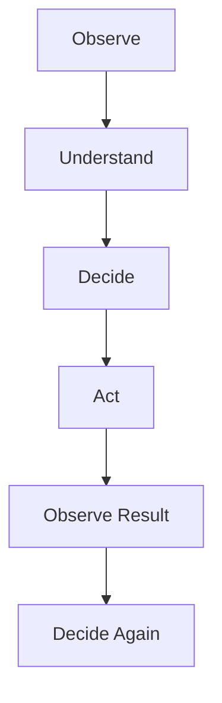

A simple conceptual architecture:

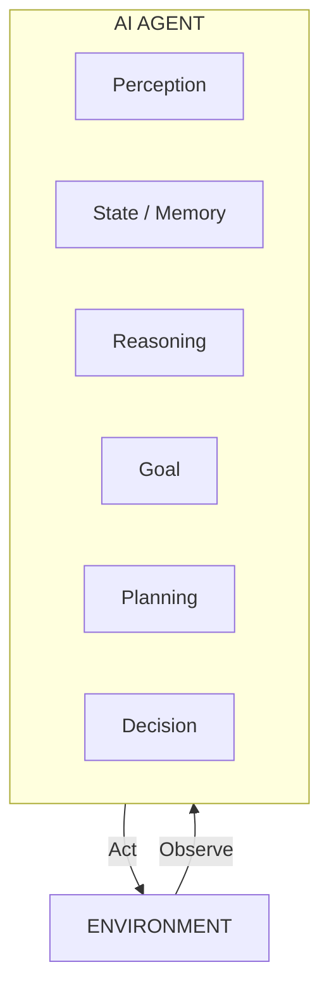

For cybersecurity specifically:

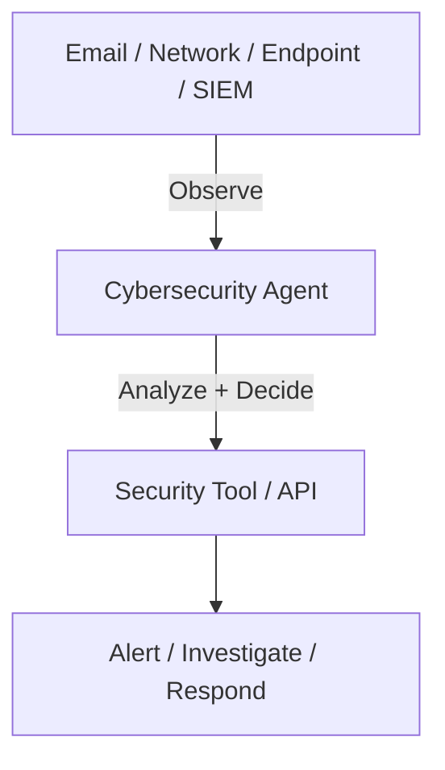

NIST describes an agent as software that can interact with an environment, receive information, and take self-directed actions toward a larger goal.

---

## 2. Two Major Taxonomies

### Classical AI Agent Types

These focus on **decision-making behavior**:

1. Simple Reflex Agent
2. Model-Based Reflex Agent
3. Goal-Based Agent
4. Utility-Based Agent
5. Learning Agent

### Modern Agent Architectures

These focus more on **how the system operates**:

1. Reactive
2. Deliberative / Planning
3. Tool-Using
4. ReAct
5. Autonomous
6. Hierarchical
7. Sequential
8. Parallel
9. Collaborative
10. Multi-Agent
11. Human-in-the-Loop
12. Human-on-the-Loop
13. Debate / Competitive

These aren't necessarily mutually exclusive species. They are often **design patterns** that can be combined.

---

## PART A — CLASSICAL AI AGENTS

---

## 3. Simple Reflex Agent

### Definition

A **Simple Reflex Agent** makes a decision based mainly on the **current percept/input**.

The basic rule is: `IF condition THEN action`

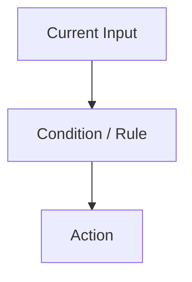

### Cybersecurity Example

Suppose a firewall sees `Source IP = 192.168.x.x` and the IP exists in a blocklist.

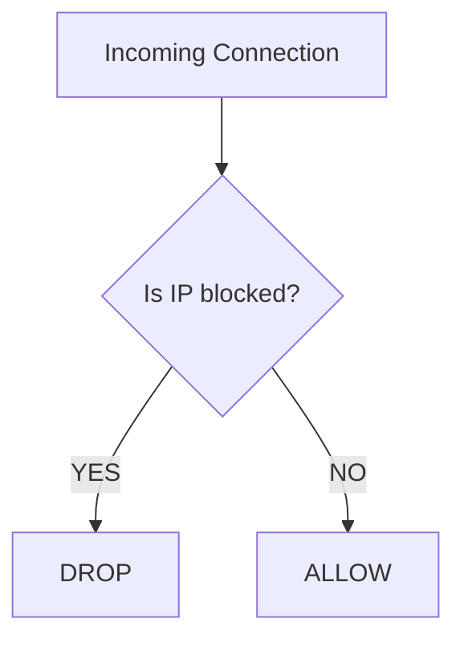

### Behavior & Pros/Cons

- **Behavior:** `EVENT → RULE → ACTION`. No sophisticated planning.
- **Advantages:** Very fast, simple, predictable, easy to implement and audit.
- **Limitations:** Lack of context.
- **Use Cases:** Firewall rules, basic IDS rules, blocklists, threshold alerts.

> **Memory trick:** Simple Reflex = SEE → RULE → ACT

---

## 4. Model-Based Reflex Agent

A model-based agent adds an **internal state/model of the environment**.
Instead of asking only "What is happening now?", it also considers "What happened before, and what is the current state?"

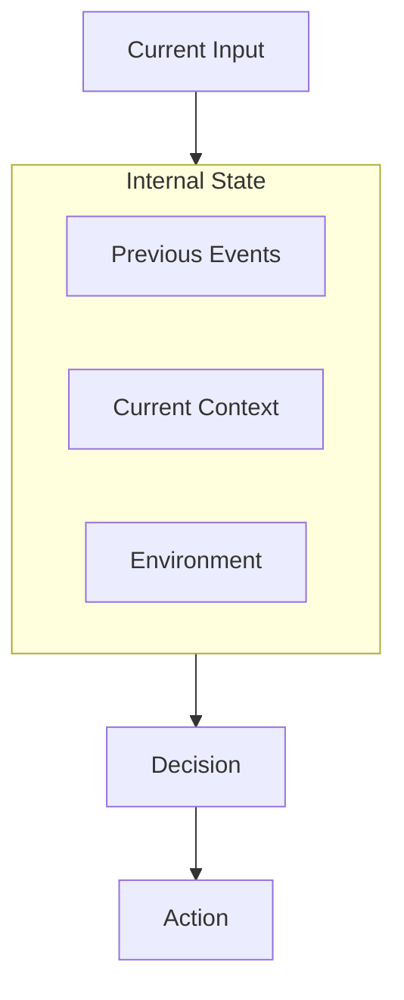

### Why Internal State Matters

A simple reflex agent might see `PowerShell` and alert. A model-based agent sees the sequence: `User Login → Document → PowerShell → Executable → External Connection` and knows the context.

### Cybersecurity Use Cases

- User behavior monitoring
- Login anomaly detection
- Attack-chain detection

> **Memory trick:** Model-Based = SEE + REMEMBER STATE → ACT

---

## 5. Goal-Based Agent

A goal-based agent asks: **"What am I trying to achieve?"**

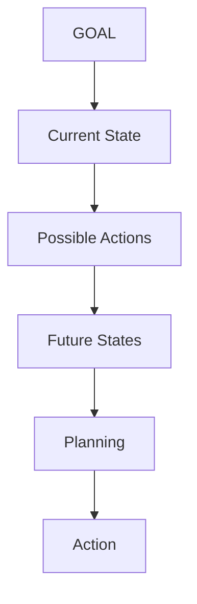

### Cybersecurity Example — Phishing Investigation

- **Goal:** Determine whether an email belongs to a phishing campaign.
- **Plan:** Parse email → Extract URLs/domains/IPs → Analyze headers → Check threat intel → Correlate IOCs → Generate report.

### Planning vs Reflex

A simple reflex agent triggers on a suspicious URL. A goal-based agent plans an investigation with multiple steps to collect evidence. If the threat intel API is down, it can re-plan to use internal DNS logs.

### Cybersecurity Use Cases

- Incident investigation
- Threat hunting
- Digital forensics workflows

> **Memory trick:** Goal-Based = WHAT DO I NEED TO ACHIEVE?

---

## 6. Utility-Based Agent

A utility-based agent asks: **"Which available action gives the most desirable outcome?"**
This is important when multiple objectives or trade-offs exist.

### Cybersecurity Example

Suspicious traffic is detected. Possible actions: Block, Monitor, Rate-limit.
Each action balances **Security**, **Availability**, and **Cost**.

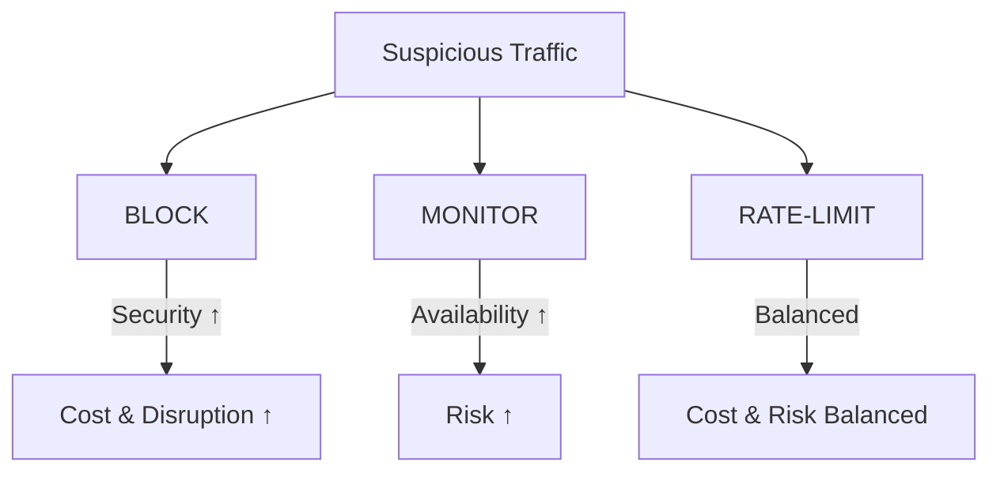

If a system blocks everything, false positives and business disruption rise. If it blocks nothing, security risk rises. Utility-based agents evaluate these trade-offs mathematically.

> **Memory trick:** Utility-Based = WHICH ACTION IS MOST DESIRABLE?

---

## 7. Learning Agent

A learning agent can **improve its behavior using experience and feedback**.

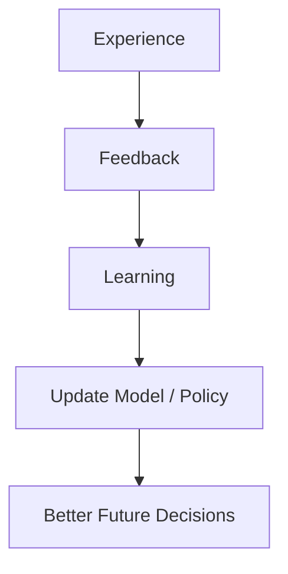

### Cybersecurity Example

An agent processes 10,000 login events with analyst feedback (Normal vs Attack). It learns patterns related to password spraying, impossible travel, etc., to make better future predictions and reduce false positives.

> **Memory trick:** Learning Agent = EXPERIENCE → LEARN → IMPROVE

---

## PART B — MODERN AGENT BEHAVIORS

The classical types explain **decision-making**. Modern architectures explain **how the agent executes tasks**.

---

## 8. Behaviors Explained (With Examples & Diagrams)

Here is a deep dive into how modern agents actually get work done, explained in simple English.

### 8.1 Reactive Agent

Responds to events immediately without deep thinking. `EVENT → ACTION`.

**Example:** Malware is detected on a laptop. The agent immediately cuts off network access.

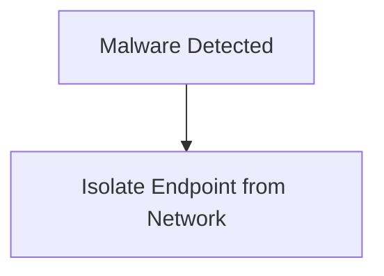

### 8.2 Deliberative / Planning Agent

Takes time to think and create a step-by-step plan before doing anything. `Goal → Plan → Execute`.

**Example:** Investigating a compromised server. The agent writes down a 5-step checklist before starting.

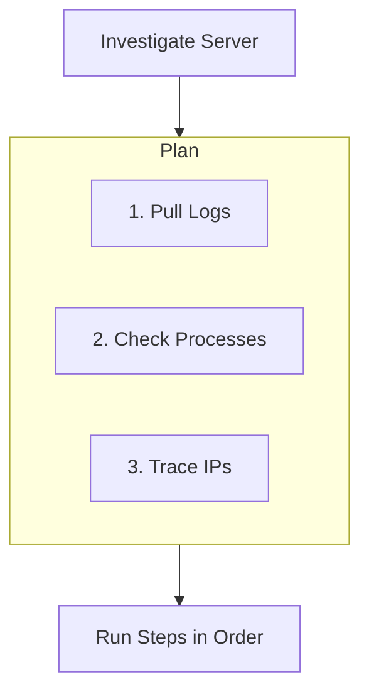

### 8.3 Tool-Using Agent

Can reach out to external software to get facts, rather than just guessing.

**Example:** An agent gets an IP address, then uses three different cybersecurity tools to check its reputation.

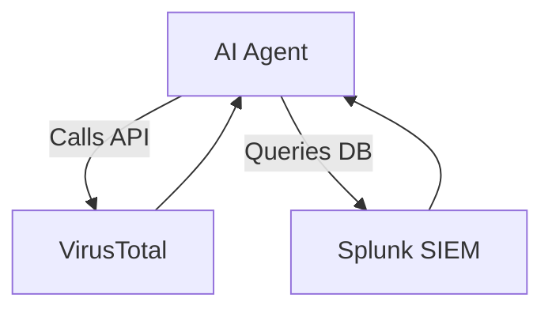

### 8.4 ReAct Agent (Reason + Act)

Thinks out loud, takes an action, looks at the result, and then thinks again. `Reason → Act → Observe → Reason`.

**Example:**

1. _Reason:_ I need to know who owns this domain.
2. _Act:_ Runs WHOIS tool.
3. _Observe:_ It's registered in Russia.
4. _Reason:_ That's suspicious. Now I should check if they sent any emails...

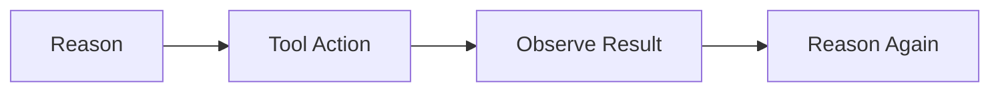

### 8.5 Autonomous Agent

Given a high-level goal, it works completely on its own for a long time, fixing its own mistakes until the job is done.

**Example:** "Write a report on the latest ransomware." It searches the web, reads articles, writes a draft, checks its own grammar, and saves the file.

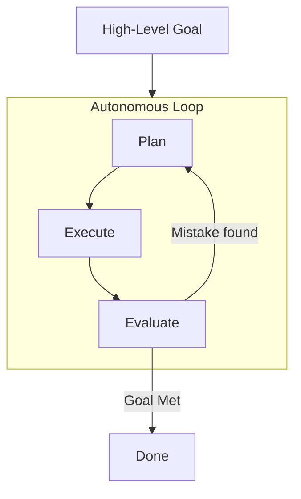

### 8.6 Hierarchical Agent

A boss agent gives orders to worker agents.

**Example:** A "Security Chief" agent tells the "Network Agent" to check firewalls and the "Email Agent" to check phishing logs.

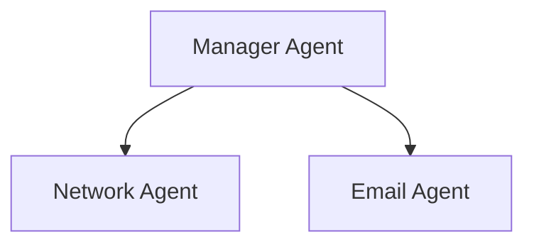

### 8.7 Sequential vs Parallel Agents

- **Sequential:** Like an assembly line. Agent A finishes, hands it to Agent B, who hands it to Agent C.
- **Parallel:** Like a team working at the same time. Agent A, B, and C all work at once, then combine their work.

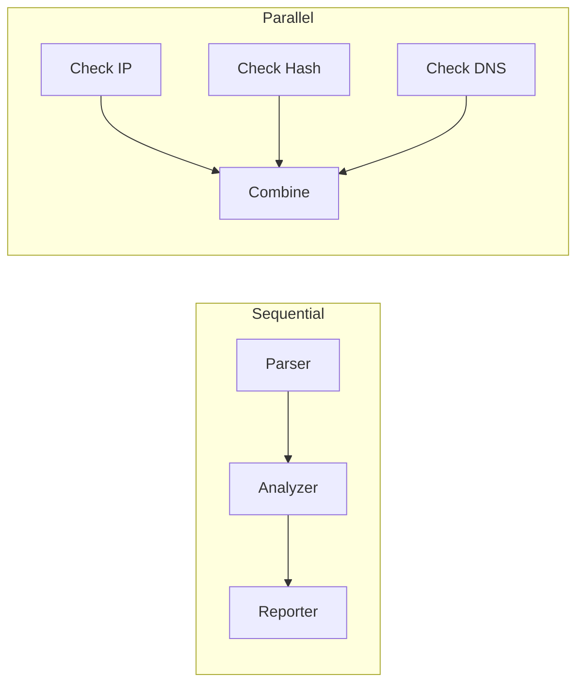

### 8.8 Collaborative / Multi-Agent Systems

Specialized agents talk to each other to solve a puzzle together.

**Example:** The Endpoint Agent says "I saw a weird file", and the Network Agent replies "I saw that file talking to a bad server!"

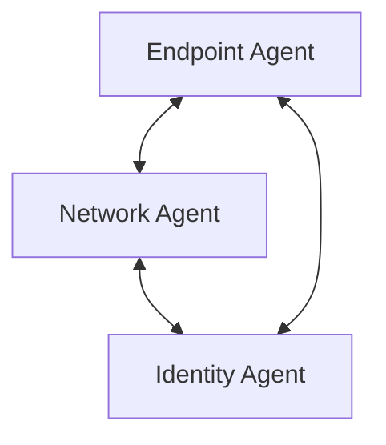

### 8.9 Human-in-the-Loop vs Human-on-the-Loop

- **In-the-Loop:** The agent asks for permission before doing something dangerous.
- **On-the-Loop:** The agent does everything automatically, but a human watches a dashboard and can press a "stop" button.

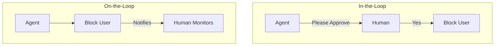

### 8.10 Debate / Competitive Agents

Two agents argue with each other to find the truth. A third agent acts as the judge.

**Example:** Agent A says "This email is a phishing attack." Agent B says "No, it's just a marketing newsletter." The Judge reviews their arguments and decides.

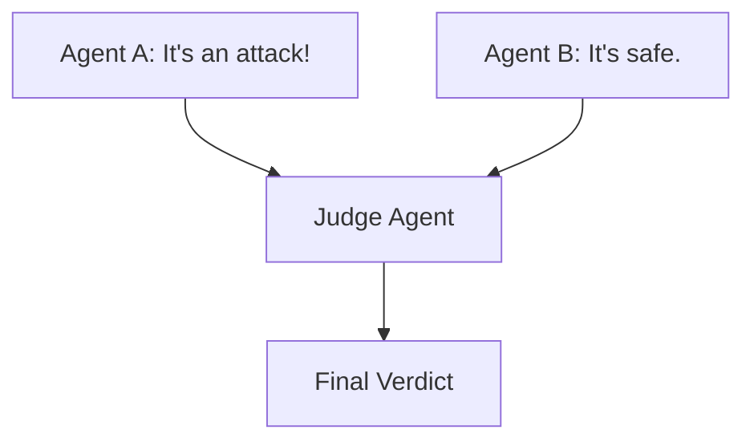

---

## 9. Final Mental Model & Cheat Sheet

| Type                   | One-line definition                                                        |
| ---------------------- | -------------------------------------------------------------------------- |
| **Simple Reflex**      | Acts according to current input and predefined rules.                      |
| **Model-Based Reflex** | Uses current input plus an internal state of the environment.              |
| **Goal-Based**         | Selects actions that help achieve a specified goal.                        |
| **Utility-Based**      | Selects among actions by evaluating their expected desirability/utility.   |
| **Learning**           | Improves its behavior using experience or feedback.                        |
| **Reactive**           | Responds directly to current events.                                       |
| **Planning**           | Creates and executes a sequence of actions toward a goal.                  |
| **Tool-Using**         | Uses external tools, APIs, databases, or systems to perform tasks.         |
| **ReAct**              | Alternates reasoning and actions while observing tool/environment results. |
| **Autonomous**         | Performs multi-step tasks with limited direct human intervention.          |
| **Hierarchical**       | Decomposes a large task into smaller tasks handled at different levels.    |
| **Sequential**         | Executes agents/tasks in a defined sequence.                               |
| **Parallel**           | Executes independent tasks simultaneously.                                 |
| **Collaborative**      | Multiple agents communicate and cooperate.                                 |
| **Multi-Agent**        | Multiple specialized agents work together toward a larger objective.       |
| **Human-in-the-Loop**  | Human approval is required for selected decisions/actions.                 |
| **Human-on-the-Loop**  | Agent operates automatically while humans supervise.                       |
| **Debate/Competitive** | Multiple agents independently challenge or evaluate possible conclusions.  |

---

## 10. Project Ideas (Cybersecurity Focus)

Here are two complete project ideas you can build to practice these concepts, using modern tech stacks.

### Project 1: AI Phishing Investigation Team (Multi-Agent System)

**Concept:** Build a team of agents that work together (Collaborative & Hierarchical) to analyze suspicious emails and decide if they are dangerous.

#### Architecture Diagram

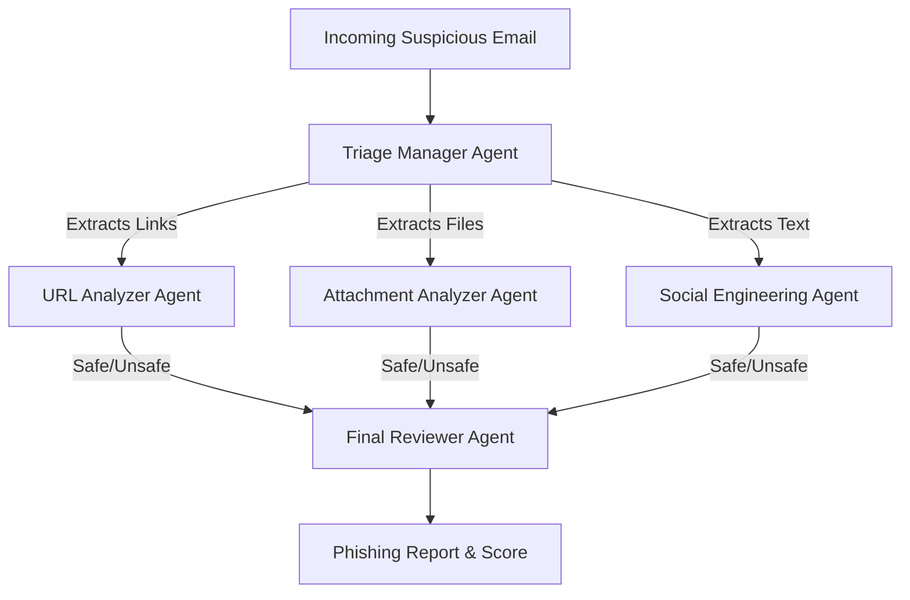

#### Tech Stack

- **Framework:** LangGraph or CrewAI (for multi-agent coordination)
- **Language:** Python
- **LLM:** OpenAI GPT-4o or Anthropic Claude 3.5 Sonnet
- **Tools:**
- [VirusTotal API](https://developers.virustotal.com/) (for URL/File checking)
- [URLScan.io API](https://urlscan.io/docs/api/) (for domain checking)
- **Interface:** Streamlit or Gradio for a simple web UI.

#### Step-by-Step Implementation

1. **Create the Tools:** Write Python functions to call VirusTotal and URLScan APIs.
2. **Define the Agents:** Create prompts for the URL Agent (focuses on domains), File Agent (focuses on malware signatures), and Text Agent (focuses on urgency/manipulation).
3. **Set up the Manager:** Use a hierarchical pattern where the Manager reads the email, splits the tasks, and sends them to the specialized agents.
4. **Compile the Results:** The Reviewer agent takes the three reports and outputs a final JSON report with a threat score (0-100).

---

### Project 2: Auto-Remediation Bot with Human-in-the-Loop

**Concept:** A ReAct / Tool-Using agent that detects suspicious logins, gathers evidence, and proposes locking the account—but waits for human approval before executing the lock.

#### Architecture Diagram

```mermaid
graph TD
  SIEM[SIEM Alert: Impossible Travel] --> Agent[ ReAct Security Agent]

  Agent <-->|Tool: Query Location| GeoIP[GeoIP Database]
  Agent <-->|Tool: Query Devices| MDM[Device Manager]

  Agent -->|Proposes Action| Slack[ Slack / MS Teams Bot]

  Slack -->|Approve| Exec[ Lock Azure AD Account]
  Slack -->|Reject| Ignore[ Mark False Positive]
```

#### Tech Stack

- **Framework:** Semantic Kernel or standard LangChain
- **Language:** TypeScript / Node.js
- **LLM:** GPT-4o-mini (fast and cheap for tool calling)
- **Tools:**
- [MaxMind GeoIP](https://dev.maxmind.com/geoip/) (for location checking)
- [Microsoft Graph API](https://learn.microsoft.com/en-us/graph/api/overview) (for locking Azure AD accounts)
- **Interface:** Slack API (for the Human-in-the-Loop button).

#### Step-by-Step Implementation

1. **Listen for Alerts:** Create a simple webhook that receives a fake "impossible travel" alert.
2. **Build the ReAct Loop:** The agent receives the alert, uses the GeoIP tool to check the IP addresses, and uses a device tool to check if the user is on a known laptop.
3. **Send to Slack:** If the agent decides it's an attack, it sends an interactive message to a Slack channel with two buttons: "Approve Lock" and "Reject".
4. **Execute (Human-in-the-Loop):** If the human clicks "Approve", the agent calls the Microsoft Graph API to lock the user's account.

---

### References

1. **IBM:** [Types of AI Agents](https://www.ibm.com/topics/ai-agent) — classical agent taxonomy and modern agent concepts.
2. **NIST CSRC:** [Agent Glossary](https://csrc.nist.gov/glossary/term/agent) — definition of an agent.
3. **NIST:** [Agentic AI](https://www.nist.gov/itl/ai-risk-management-framework) — current work on agentic AI, autonomy, evaluation, and risk management.
4. **Yao et al.:** [ReAct: Synergizing Reasoning and Acting in Language Models](https://arxiv.org/abs/2210.03629) — reasoning/action loop and tool interaction.
5. **Wu et al.:** [AutoGen: Enabling Next-Gen LLM Applications via Multi-Agent Conversation](https://arxiv.org/abs/2308.08155) — multi-agent communication and cooperation.
